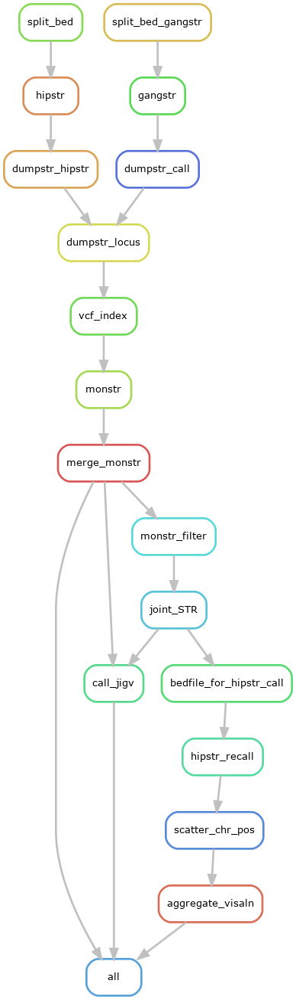

<!-- omit in toc -->
# Call DNMs in STRs (Simple Tandem Repeats)


--- 

- [Introduction](#introduction)
- [Results](#results)
  - [Working space at Biowulf](#working-space-at-biowulf)
  - [VizAln output](#vizaln-output)
    - [Example of VisAln realignment](#example-of-visaln-realignment)


--- 

## Introduction

We explored to call de novo mutations in STRs using HipSTR, GangSTR and MonSTR. The Snakemake workflow is as illustrated as the diagram below: 



In particular, there are several features in this workflow:
+ We prepared identical STR reference panels for both HipSTR and GangSTR. 
  + The reference panel is derived from the one from GangSTR: hg38_ver13.bed. 
  + As HipSTR cannot take repeat unit size above 9, we restricted repeat unit size $\le$ 9 and generated the file: hg38_ver13.le9.bed.
  + And we formatted hg38_ver13.le9.bed to hg38_ver13.hipstr_9.bed, for the use with HipSTR. 
+ Both of the two STR reference panels were split into 400 chunks, so as to speed up the downstream analyses.
+ DNMs in STRs were called in two ways by each chunk: 
  + HipSTR + MonSTR
  + GangSTR + MonSTR
+ The chunks of both two DNM callings were merged in *merge_monstr*, respectively.
+ We selected DNMs as called by both of the two callings in *joint_STR*.
+ Finally, we explored two ways of visualization to facilitate manual curation.
  + By *JIGV* (in call_JIGV)
  + By [*VisAln* realignment](https://github.com/tfwillems/HipSTR/tree/master#alignment-visualization)

--- 

## Results
### Working space at Biowulf
+ /data/DCEG_Chernobyl/NP0436-HE5/Chernobyl_data/STR_DNM2
  + Snakefile_STR3 (Snakemake workflow)
  + STR/
    + hg38_ver13.le9.bed
    + hg38_ver13.hipstr_9.bed
  + output/ (output of the workflow)
    + merge_monstr/
      + gangstr.all_mutations.tab ([merged calls of GangSTR+MonSTR](https://github.com/gymreklab/STRDenovoTools#outprefixall_mutationstab))
      + gangstr.locus_summary.tab ([merged calls of GangSTR+MonSTR](https://github.com/gymreklab/STRDenovoTools#outprefixlocus_summarytab))
      + hipstr.all_mutations.tab ([merged calls of HipSTR+MonSTR](https://github.com/gymreklab/STRDenovoTools#outprefixall_mutationstab))
      + hipstr.locus_summary.tab ([merged calls of HipSTR+MonSTR](https://github.com/gymreklab/STRDenovoTools#outprefixlocus_summarytab))
    + joint_STR/
      + gangstr_hipstsr.final.tab (DNMs called by both HipSTR & GangSTR + MonSTR).
    + call_JIGV
      + both_{family_id}.JIGV.html
    + vizaln/
      + {family_id}
        + variants
          + chr10_46899557.html
          + chr14_98831450.html

### VizAln output
VizAln is a tool from the HipSTR package to visualize the MGS reads in html page. It was designed to generate HTML page with random file name.  We had to make some revisions to apply it in our workflow. Different from JIGV, each HTML output from VizAln is for one DNM variant.  

Below is the outline of the VizAln output: 
```bash
tree output/vizaln/
output/vizaln/
├── t0311
│   ├── DONE
│   ├── t0311.aln.viz.gz
│   ├── t0311.aln.viz.gz.tbi
│   ├── t0311.hipstr.log
│   ├── t0311_recall.bed
│   ├── t0311.vcf.gz
│   ├── t0311.vcf.gz.tbi
│   └── variants
│       ├── chr10_46899557.dnm
│       ├── chr10_46899557.html
│       ├── chr14_98831450.dnm
│       ├── chr14_98831450.html
│       ├── chr15_61218675.dnm
│       ├── chr15_61218675.html
│       ├── chr5_71033413.dnm
│       ├── chr5_71033413.html
│       ├── chr6_84500344.dnm
│       └── chr6_84500344.html
...
└── t0612
    ├── DONE
    ├── t0612.aln.viz.gz
    ├── t0612.aln.viz.gz.tbi
    ├── t0612.hipstr.log
    ├── t0612_recall.bed
    ├── t0612.vcf.gz
    ├── t0612.vcf.gz.tbi
    └── variants
        ├── chr6_38571975.dnm
        └── chr6_38571975.html

```

#### Example of VisAln realignment

An example of VisAln realignment is available [here](./data/chr6_38571975.html).
