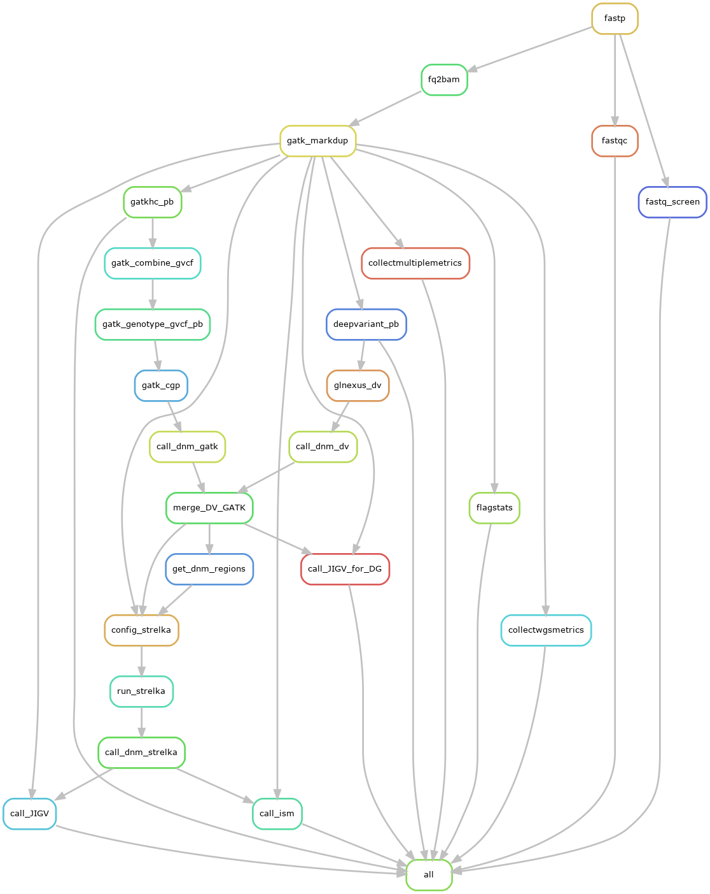
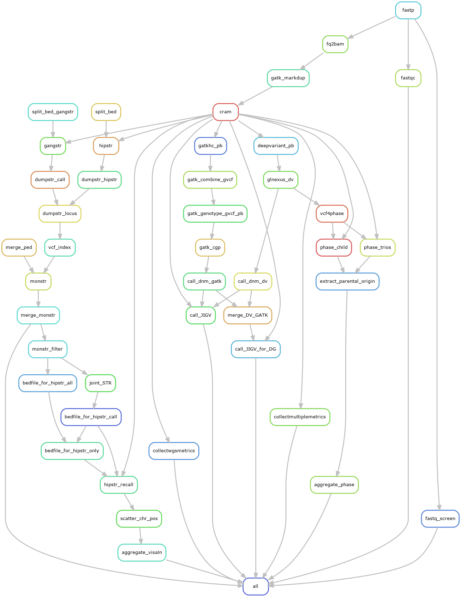

<!-- omit in toc -->
# Processing 107 new CGR data using TriosCompass

---
- [Introduction](#introduction)
- [The pipeline](#the-pipeline)
  - [Configuration and input files](#configuration-and-input-files)
    - [Fastq input files](#fastq-input-files)
    - [Manifest file and its schema specification](#manifest-file-and-its-schema-specification)
    - [Pedigree files](#pedigree-files)
  - [Configure file for Snakemake workflow](#configure-file-for-snakemake-workflow)
- [Get started](#get-started)
- [Workflow components for Fastq input files](#workflow-components-for-fastq-input-files)
- [Output](#output)
  - [Location of output files](#location-of-output-files)
  - [DNM candidates](#dnm-candidates)
  - [JIGV html pages](#jigv-html-pages)
  - [QC metrics](#qc-metrics)
    - [Output of MultiQC](#output-of-multiqc)
    - [Problematic samples in the 107 CGR samples](#problematic-samples-in-the-107-cgr-samples)
  - [Parental origin of DNMs](#parental-origin-of-dnms)
  - [Output of dnSTRs](#output-of-dnstrs)
- [Post-analyses](#post-analyses)
  - [Generate a summary report](#generate-a-summary-report)
  - [Annotate DNMs](#annotate-dnms)
    - [Prepare annotation databases for Annovar](#prepare-annotation-databases-for-annovar)
  - [Annotate dnSTRs](#annotate-dnstrs)
  - [Summary tables and figures](#summary-tables-and-figures)


---

## Introduction

The 107 WGS data are from Chernobyl Trios-Additional Families (see the details about the study in the [fogbugz: 31945: SR0436-012 Chernobyl Trios-Additional Families for 80x Germline WGS-ANALYSIS](https://cgr-bugz.nci.nih.gov/login?dest=%2ff%2fcases%2f31945)). 

This workflow *TriosCompass* has been generally introduced [here](https://github.com/NCI-CGR/TriosCompass_v2/blob/main/README.md).  In this study, we had call DNMs using two approaches:
1. The candidates called by at least two out of the 3 callers: DeepVariant, GATK HaplotypeCaller and Strelka (see [Snakefile](./Snakefile));

2. The candidates called by both DeepVariant and GATK HaplotypeCaller (see [Snakefile_CGRv2](./Snakefile_CGRv2)).  


We took the second one as final approach to have higer precision at the trade-off of the recall.  

---

## The pipeline
### Configuration and input files
#### Fastq input files
Fastq files were transferred from /mnt/nfs/gigantor/ifs/DCEG/CGF/Sequencing/Illumina/HiSeq/PostRun_
Analysis/Data/ (under the CGR T-drive) to /data/DCEG_Trios/new_cgr_data/fastq at biowulf via globus. 


```bash
tree /data/DCEG_Trios/new_cgr_data/fastq | head -n 40
/data/DCEG_Trios/new_cgr_data/fastq
├── 220817_A00423_0187_AH2JYFDSX5
│   └── CASAVA
│       └── L1
│           └── Project_NP0436-HE5
│               ├── Sample_SC074219-CTGATCGT-GCGCATAT
│               │   ├── SC074219_CTGATCGT-GCGCATAT_L001_R1_001.fastq.gz
│               │   └── SC074219_CTGATCGT-GCGCATAT_L001_R2_001.fastq.gz
│               ├── Sample_SC108472-TACGCTAC-CGTGTGAT
│               │   ├── SC108472_TACGCTAC-CGTGTGAT_L001_R1_001.fastq.gz
│               │   └── SC108472_TACGCTAC-CGTGTGAT_L001_R2_001.fastq.gz
│               ├── Sample_SC109336-CCTTGATC-GATGGAGT
│               │   ├── SC109336_CCTTGATC-GATGGAGT_L001_R1_001.fastq.gz
│               │   └── SC109336_CCTTGATC-GATGGAGT_L001_R2_001.fastq.gz
│               ├── Sample_SC109341-TGTGACTG-AGCCTATC
│               │   ├── SC109341_TGTGACTG-AGCCTATC_L001_R1_001.fastq.gz
│               │   └── SC109341_TGTGACTG-AGCCTATC_L001_R2_001.fastq.gz
│               ├── Sample_SC109353-GAGCAGTA-TGAGCTGT
│               │   ├── SC109353_GAGCAGTA-TGAGCTGT_L001_R1_001.fastq.gz
│               │   └── SC109353_GAGCAGTA-TGAGCTGT_L001_R2_001.fastq.gz
│               ├── Sample_SC109368-TGGTAGCT-AGGTGTTG
│               │   ├── SC109368_TGGTAGCT-AGGTGTTG_L001_R1_001.fastq.gz
│               │   └── SC109368_TGGTAGCT-AGGTGTTG_L001_R2_001.fastq.gz
│               ├── Sample_SC109373-GTTGACCT-CAGTGCTT
│               │   ├── SC109373_GTTGACCT-CAGTGCTT_L001_R1_001.fastq.gz
│               │   └── SC109373_GTTGACCT-CAGTGCTT_L001_R2_001.fastq.gz
│               └── Sample_SC109390-CACCTGTT-AGGATAGC
│                   ├── SC109390_CACCTGTT-AGGATAGC_L001_R1_001.fastq.gz
│                   └── SC109390_CACCTGTT-AGGATAGC_L001_R2_001.fastq.gz
├── 220817_A00423_0188_BH2JVVDSX5
│   └── CASAVA
│       └── L1
│           └── Project_NP0436-HE5
│               ├── Sample_SC742298-CTAGGCAT-ACAGAGGT
│               │   ├── SC742298_CTAGGCAT-ACAGAGGT_L001_R1_001.fastq.gz
│               │   └── SC742298_CTAGGCAT-ACAGAGGT_L001_R2_001.fastq.gz
│               ├── Sample_SC742299-TACATCGG-TCCACGTT
│               │   ├── SC742299_TACATCGG-TCCACGTT_L001_R1_001.fastq.gz
│               │   └── SC742299_TACATCGG-TCCACGTT_L001_R2_001.fastq.gz
│               ├── Sample_SC742301-TGTGCGTT-TGAGACGA
...
```

####  Manifest file and its schema specification
The locations of each pair of fastq are specified in a manifest file.  The manifest file is a csv file with typical NCI-CGR sample sheet format, with additional two columns (for the absolute paths to the paired Fastq files): R1, R2 (see https://github.com/NCI-CGR/TriosCompass_v2/blob/main/pep/manifest_fastq.csv).  The columns "CGR_ID", "INDEX", "FLOWCELL", "R1/2" are required and all the others are optional.  Of them, "CGR_ID", "INDEX", and "FLOWCELL" are used to define the read groups in the bam files, in the format:  
```
@RG\\tPL:ILLUMINA\\tID:{FLOWCELL}_{LANE}\\tSM:{CGF_ID}\\tPU:{CGF_ID}_{FLOWCELL}\\tLB:{CGF_ID}_{INDEX}
```

The format of the manifest file is specified by schemas/cgr_manifest_schema.yaml. The manifest file will be automatically validated at the beginning of the Snakemake workflow via the new Snakemake feature of PEP (protable encapsulated project).  Users may vist [here](https://snakemake.readthedocs.io/en/stable/snakefiles/configuration.html#configuring-scientific-experiments-via-peps) to learn more about this PEP feature. 

:bookmark: Note that one sample is allowed to have multiple fastq files from different flow cells.  The workflow will combine those fastq files and generate single bam file for each sample.

#### Pedigree files
In additioanl to the fastq input files, another important input files are pedigress files, to specify relationship among subjects/samples.  It always consists of one child and its parents. For example, for a family with two kids, we need two peidgree files:

```bash
cat  new_cgr_pedfiles/t0679c1.ped 
t0679c1 SC742188        0       0       1       1
t0679c1 SC742277        0       0       2       1
t0679c1 SC742275        SC742188        SC742277        1       1

cat  new_cgr_pedfiles/t0679c2.ped 
t0679c2 SC742188        0       0       1       1
t0679c2 SC742277        0       0       2       1
t0679c2 SC742276        SC742188        SC742277        2       1

```  

:bookmark: Note that the samples are ordered in the pedigree file in this way: father, mother and kid.  It may affect the order of the sample tracks in the output html page of JIGV.

---
---
### Configure file for Snakemake workflow
Lastly but also importantly, a configure file for the Snakemake workflow is required:
```yaml
name: CGR_Trios_Data1

pep_version: 2.0.0
sample_table: manifest_fastq.csv
output_dir: "output"
input_bam_dir: "bam"

hg38_ref: "ref/Homo_sapiens_assembly38.fasta"
wgs_interval: "ref/hg38.wgs_interval.bed"
ped_dir: "new_cgr_pedfiles"

### Settings for dnSTR calling
split_total: 400
gangstr_panel: "STR/hg38_ver13.le9.bed"
hipstr_panel: "STR/hg38_ver13.hipstr_9.bed"
hipstr_filters: " --min-span-coverage 3 --min-supp-reads 3 "
gangstr_filters: " --max-perc-encl-parent 0.05 --min-encl-match 0.9 --min-total-encl 10 --gangstr "
dup_reg: "STR/GRCh38GenomicSuperDup.bed.gz" # come with GRCh38GenomicSuperDup.bed.gz.tbi 

### WhatsHap
phase_window: 10000

# In CGR manifest file, CGF_ID + Flowcell should be unique
sample_modifiers:
  append:
    sample_name: "sn"
  derive:
    attributes: [sample_name]
    sources:
      sn: "{CGF_ID}_{FLOWCELL}"
```

---

## Get started 
Once the input files, resource data and the configure are ready, users may run the workflow using the wrapper shell script run_it_cgr.sh:

```bash
cd  /data/DCEG_Trios/new_cgr_data/TriosCompass_v2
conda activate snakemake

sbatch -J cgrv2 -t 200:00:00 --export=ALL --mem=12g -p norm  --wrap='./run_it_cgrv2.sh '
```

+ run_it_cgrv2.sh
  + :bookmark: Users may need change TMPDIR setting accordingly.
  + The profile workflow/profiles/biowulf is used in this example, which is tailored for the HPC system *biowulf* at NIH. 
```bash
#!/bin/bash
#SBATCH --time=200:00:00
#SBATCH -o ${PWD}/snakemake.%j.out
#SBATCH -e ${PWD}/snakemake.%j.err


# conda activate snakemake
mkdir -p TMP
export TMPDIR=TMP

module load singularity 

snakemake --skip-script-cleanup -k  --keep-incomplete --rerun-incomplete --profile workflow/profiles/biowulf --verbose -p --use-conda --jobs 400 --use-singularity --use-envmodules --latency-wait 600 -T 0 -s Snakefile_CGRv2
```

---
## Workflow components for Fastq input files

This workflow starts the process from the fastq files, which is different from the one for the old Chernobyl samples.  The latter takes the exsiting bam files as the starting point.  Therefore, there are several unique components in this workflow:
+ fastp
+ fastqc
+ fastq_screen
+ fq2bam
+ gatk_markdup

Accordingly, we need provide one additional configure file for [Fastq_screen](https://stevenwingett.github.io/FastQ-Screen/).

```conf
#DATABASE       Human   fasta_human/Homo_sapiens_assembly38_masked_GRC_exclusions.fasta
DATABASE        Yeast   /data/DCEG_Trios/new_cgr_data/TriosCompass_v2/ref/fasta_nonhuman/Yeast/Saccharomyces_cerevisiae.R64-1-1.fa
DATABASE        Ecoli   /data/DCEG_Trios/new_cgr_data/TriosCompass_v2/ref/fasta_nonhuman/E_coli/Ecoli.fa
DATABASE        PhiX    /data/DCEG_Trios/new_cgr_data/TriosCompass_v2/ref/fasta_nonhuman/PhiX/phi_plus_SNPs.fa
DATABASE        Lambda  /data/DCEG_Trios/new_cgr_data/TriosCompass_v2/ref/fasta_nonhuman/Lambda/Lambda.fa
DATABASE        Vectors /data/DCEG_Trios/new_cgr_data/TriosCompass_v2/ref/fasta_nonhuman/Vectors/Vectors.fa
DATABASE        Adapters        /data/DCEG_Trios/new_cgr_data/TriosCompass_v2/ref/fasta_nonhuman/Adapters/Contaminants.fa
DATABASE        Cow     /data/DCEG_Trios/new_cgr_data/TriosCompass_v2/ref/fasta_nonhuman/Cow/GCF_002263795.1_ARS-UCD1.2_genomic.fna
DATABASE        Pig     /data/DCEG_Trios/new_cgr_data/TriosCompass_v2/ref/fasta_nonhuman/Pig/GCF_000003025.6_Sscrofa11.1_genomic.fna
BWA     /usr/local/apps/bwa/0.7.17/bwa
```     

---
## Output
### Location of output files
The workflow processed the NGS data of Chernobyl Trios-Additional Families (see the details about the study in the [fogbugz: 31945: SR0436-012 Chernobyl Trios-Additional Families for 80x Germline WGS-ANALYSIS](https://cgr-bugz.nci.nih.gov/login?dest=%2ff%2fcases%2f31945)).  Both the Snakemake workflow and the output directory is under ***/data/DCEG_Trios/new_cgr_data/TriosCompass_v2*** at biowulf.

### DNM candidates
As mentioined in the introduction, there are two sets of DNM candidates: 
+ Called by DeepVariant and GATK.
  + output/GATK_DV/D_and_G.{TRIO_ID}.dnm.vcf.gz
+ Called by DeepVariant/GATK and Strelka.
  + output/slivar/strelka_{TRIO_ID}.dnm.vcf.gz

Here, {TRIO_ID} is the placeholder of the trio identifier, as specified in the pedigree file.  For instance, t0599c1, t0315c2 and etc.

### JIGV html pages
Accordinlgy, JIGV snapshots of both sets of DNMs can be found under output/call_JIGV/
+ D_and_G_{TRIO_ID}.JIGV.html
+ strelka_{TRIO_ID}.JIGV.html

### QC metrics
There are many metrics generated by NGS tools employed in this workflow:
+ fastp
+ fastq_screen
+ samtools flagstats
+ collectwgsmetrics (Picard)
+ collectmultiplemetrics (Parabricks)
+ GATK MarkDuplicate

Those output files can all be processed and summerized by *MultiQC*.  Below is a multiqc command for your example:  

```bash
multiqc --title QC --filename multiqc_report.html --outdir output_multiqc output/{collectmultiplemetrics,collectwgsmetrics,fastp,fastqc,fastq_screen,flagstats,gatk_markdup}  --interactive
|         searching | ━━━━━━━━━━━━━━━━━━━━━━━━━━━ 100% 4092/4092 
|            picard | Found 107 AlignmentSummaryMetrics reports
|            picard | Found 107 GcBiasMetrics reports
|            picard | Found 107 InsertSizeMetrics reports
|            picard | Found 107 MarkDuplicates reports
|            picard | Found 107 QualityByCycleMetrics reports
|            picard | Found 107 QualityScoreDistributionMetrics reports
|            picard | Found 107 QualityYieldMetrics reports
|            picard | Found 107 WgsMetrics reports
|          samtools | Found 107 flagstat reports
|          samtools | Found 107 idxstats reports
|      fastq_screen | Found 124 reports
|             fastp | Found 248 reports
|            fastqc | Found 248 reports
|           multiqc | Compressing plot data
|           multiqc | Previous MultiQC output found! Adjusting filenames..
|           multiqc | Use -f or --force to overwrite existing reports instead
|           multiqc | Report      : output_multiqc/multiqc_report_1.html
|           multiqc | Data        : output_multiqc/multiqc_report_data_1
|           multiqc | MultiQC complete


```
:bookmark: The json output from fastp needs to be named as "*fastp.json" to be recoganized by MultiQC.  We have modified the workflow accordingly.


#### Output of MultiQC
We have generated two sets of MultiQC report files under the folder output_multiqc/: 
+ multiqc_report.html (static mode)
+ multiqc_report_1.html (interactive mode)

#### Problematic samples in the 107 CGR samples
+ SC074219 (t0450c2) is a singleton in this analysis and the data of its parents are processed in the previous study.
+ ***SC736795*** has coverage about 28X, which is much lower than the others.
+	SC108472 has many unmapped reads, origin from bateria and viruses commonly found in the upper respiratory tractor.  It is confimred that the sample was procured from saliva.
+ In the trio t0588c1 (kid: SC109409; father: SC109418; mother: SC109419), the sample ***SC109418*** lacks of the expected relatedness with SC109409.

In the end, we dropped all the 3 samples of the trio t0588c1, and moved the sample SC074219 (t0450c2) to the processing of 340 old Chernobyl samples.

### Parental origin of DNMs
Parentalorigin of DNMs are saved as tab-delimited files:
  + output/phase_DNMs/<trio>.parental_origin.tab

The description of the file format is available [here](https://github.com/NCI-CGR/TriosCompass_v2/tree/8trios#identify-parental-origin-of-dnms-using-whatshap).

### Output of dnSTRs

We had planned to dnSTR candidates jointly prediced by HipSTR and GangSTR.  During the manual curation, we found that the joint predicts are good but less than expected, and the predicts from HipSTR (not GangSTR) are good in general.  

The dnSTRs predicted by HipSTR are available at the file:
  output/monstr_filter/hipstr.filtered.tab

We have also generated visulization for dnSTR using VizAln (from HipSTR package).  And we classied dnSTRs into two classes: "both" and "hipstr_only", based on whether it is predicted by both HipSTR and GangSTR or HipSTR only.  The html output files are available for each individual dnSTR under output/vizaln/<trio>/.

```bash
tree output/vizaln/t0600c1/{both,hipstr_only} | grep -v dnm
output/vizaln/t0600c1/both
├── DONE
└── variants
    ├── chr10_77376949.html
    ├── chr13_49622153.html
    ├── chr15_34451626.html
    ├── chr15_34519652.html
    ├── chr15_83917418.html
    ├── chr17_39037973.html
    ├── chr2_129489580.html
    ├── chr22_20821590.html
    ├── chr22_29238255.html
    ├── chr3_59683847.html
    ├── chr3_75419179.html
    ├── chr3_75430889.html
    ├── chr3_75590180.html
    ├── chr5_166792836.html
    ├── chr5_17343356.html
    ├── chr6_26067044.html
    ├── chr6_43820353.html
    ├── chr6_72513043.html
    └── chr9_123917193.html
output/vizaln/t0600c1/hipstr_only
├── DONE
└── variants
    ├── chr10_103294239.html
    ├── chr10_42209752.html
    ├── chr11_116092983.html
    ├── chr12_118133195.html
    ├── chr12_33235425.html
    ├── chr13_49622943.html
    ├── chr14_19216662.html
    ├── chr14_35145733.html
    ├── chr14_35145808.html
    ├── chr14_35645347.html
    ├── chr14_41148928.html
    ├── chr14_41155087.html
    ├── chr14_41180537.html
    ├── chr14_41190756.html
    ├── chr14_57192876.html
    ├── chr15_21387443.html
    ├── chr15_34456402.html
    ├── chr16_12037969.html
    ├── chr1_62189833.html
    ├── chr1_63239698.html
    ├── chr1_63863708.html
    ├── chr17_46213289.html
    ├── chr17_66291733.html
    ├── chr18_11510834.html
    ├── chr18_77555366.html
    ├── chr19_20447360.html
    ├── chr19_20534454.html
    ├── chr20_10116788.html
    ├── chr21_14202992.html
    ├── chr2_131448160.html
    ├── chr22_15691984.html
    ├── chr22_20598516.html
    ├── chr2_60449520.html
    ├── chr3_75399925.html
    ├── chr3_75423684.html
    ├── chr3_75457555.html
    ├── chr4_184834389.html
    ├── chr4_186176918.html
    ├── chr4_68615302.html
    ├── chr4_68618256.html
    ├── chr4_9118634.html
    ├── chr5_161893008.html
    ├── chr7_67737806.html
    └── chr7_98026475.html

2 directories, 128 files
```

The html output example and some details about callinng dnSTRs can be found [here](https://github.com/NCI-CGR/TriosCompass_v2/blob/main/Call_DNMs_in_STRs.md).

:bookmark: The ".dnm" files are dummy files for the use of Snakemake workflow in the process of scatter-gather dnSTRs.

--- 

## Post-analyses
### Generate a summary report
```bash
cd /data/DCEG_Trios/new_cgr_data/TriosCompass_v2

# drop the trio t0588c1 and compile a list of trios ids
ls  new_cgr_pedfiles/ | xargs -n1  -I% basename % .ped | grep -v t0588c1 > trios.lst

wc -l trios.lst
39 trios.lst

### Re-create ID to get rid of chr4:9142040:T:TATAATATAATACAATATATA;chr4:9142040:T:TATAATATAATATAATATATAATATA;chr4:9142040:T:TATAATATAATATATAATATA
# -t: tab-delim
# -H no header line
# -s: trean numeric fields as string -
# --at 2: insert the new column at the 2nd column
cat trios.lst | parallel "zgrep -v "^#" output/GATK_DV/D_and_G.{}.dnm.vcf.gz | awk -v var={} -v OFS='\t' '{print var,\$1,\$2,\$4,\$5'}" | csvtk mutate2 -t -H -s -e '$2 + ":" + $3 + ":" + $4 + ":" + $5' --at 2 > dnm_all.tab

wc -l dnm_all.tab
3293 dnm_all.tab

### get phase information
cat trios.lst | parallel "cat output/phase_DNMs/{}.parental_origin.tab | awk -v var={} -v OFS='\t' '{print var,\$1,\$2}' "  > dnm_phase.tab

### Join phase information
csvtk join -t -H -f "1,2" --na NA -k dnm_all.tab dnm_phase.tab > dnm_info.tab
 
wc -l dnm_info.tab
3293 dnm_info.tab

### Add additioinal genomic context around the reference allele (+/- 1bp): xRx.
module load samtools
cat dnm_info.tab | parallel --colsep '\t'  'v=$(samtools faidx  ref/Homo_sapiens_assembly38.fasta {3}:{=4 $_-=1 =}-{=4 $_+=1 =}  | grep -v "^>"); echo {= $_ =} $v | sed "s/ /\t/g"'  :::: - > dnm_info.wi_tri.tab
```

### Annotate DNMs
#### Prepare annotation databases for Annovar
```bash
### make a directory to install databases locally
mkdir humandb

### download databases not installed at Biowulf
# genomicSuperDups  simpleRepeat
module load annovar

perl $ANNOVAR_HOME/annotate_variation.pl -downdb -build hg38  phastConsElements7way   humandb/
perl $ANNOVAR_HOME/annotate_variation.pl -downdb -build hg38  genomicSuperDups   humandb/
perl $ANNOVAR_HOME/annotate_variation.pl -downdb -build hg38  simpleRepeat   humandb/

### make symbol links of the existing databases to the local folder
ls -al $ANNOVAR_DATA/hg38
find $ANNOVAR_DATA/hg38 -type f -exec ln -fs '{}' -t humandb/ \;

# check what you got
ls -al /data/DCEG_Trios/ChernobylTrios/TriosCompass_v2/humandb/ | head -n 6
total 160382
drwxr-s---. 2 zhuw10 DCEG_Trios      4096 Feb 23 15:14 .
drwxr-s---. 2 zhuw10 DCEG_Trios      4096 Feb 28 11:47 ..
lrwxrwxrwx. 1 zhuw10 DCEG_Trios        39 Feb 23 15:14 .annovar_date -> /fdb/annovar/current/hg38/.annovar_date
lrwxrwxrwx. 1 zhuw10 DCEG_Trios        44 Feb 23 15:14 annovar_downdb.log -> /fdb/annovar/current/hg38/annovar_downdb.log
lrwxrwxrwx. 1 zhuw10 DCEG_Trios        48 Feb 23 15:14 annovar.hg38.refdb.yml -> /fdb/annovar/current/hg38/annovar.hg38.refdb.yml

### Prepare DNM input 
awk -v OFS="\t" '{if (! /^#/ && $5 != "*") print $3, $4, $4+length($5)-1, $5, $6,$2}' dnm_info.wi_tri.tab | csvtk uniq -t -f 6 | csvtk sort -t -H -k 6:N > CGR_dnm.avinput

wc -l CGR_dnm.avinput
3285 CGR_dnm.avinput

### Run the annotation 
mkdir annovar
perl $ANNOVAR_HOME/table_annovar.pl CGR_dnm.avinput /data/DCEG_Trios/ChernobylTrios/TriosCompass_v2/humandb/ --buildver hg38 --out annovar/CGR_dnm --remove --protocol refGene,knownGene,clinvar_20230416,gnomad40_genome,gnomad40_exome,phastConsElements7way,genomicSuperDups,simpleRepeat,rmsk --operation g,g,f,f,f,r,r,r,r --nastring '.'  --thread 4

```

### Annotate dnSTRs
The annotation process for dnSTRs is similar as above, except one major difference: we are annotated the region of each STR not dnSTR itself.  The whole region of STR is defined in the STR reference panel. Therefore, we need join dnSTR (predicted by HipSTR) and with the reference panel to acquire the location of STR. Besides, the annotation is more focus on genes and regions rather than filters.

```bash
### Get chr, start of dnSTR
cut -f 1,2  output/monstr_filter/hipstr.filtered.tab | csvtk del-header | csvtk uniq -t -f1,2 | sed "s/^/chr/" > hipstr_hits.lst 

wc -l hipstr_hits.lst
1612 hipstr_hits.lst

### find the matches in STR/hg38_ver13.hipstr_9.bed to get chr, start, end and additional information for STR
# save it in the format of avinput
# Note: 0 is filled in the 4- and 5-column
grep -f hipstr_hits.lst STR/hg38_ver13.hipstr_9.bed | awk -v OFS='\t' '{print $1,$2,$3,0,0,$4,$5,$6,$7}' > hipstr_hit.avinput

### annotation
perl $ANNOVAR_HOME/table_annovar.pl hipstr_hit.avinput /data/DCEG_Trios/ChernobylTrios/TriosCompass_v2/humandb/ --buildver hg38 --out annovar/chernobyl_hipstr --remove --protocol refGene,knownGene,phastConsElements7way,genomicSuperDups,simpleRepeat,rmsk --operation g,g,r,r,r,r --nastring '.'  --thread 4

wc -l annovar/chernobyl_hipstr.hg38_multianno.txt
1613 annovar/chernobyl_hipstr.hg38_multianno.txt
```

### Summary tables and figures
Summary tables and figures were generated by R, and the details can be found [here](https://github.com/NCI-CGR/TriosCompass_Benchmarking/tree/main/trio_analysis).