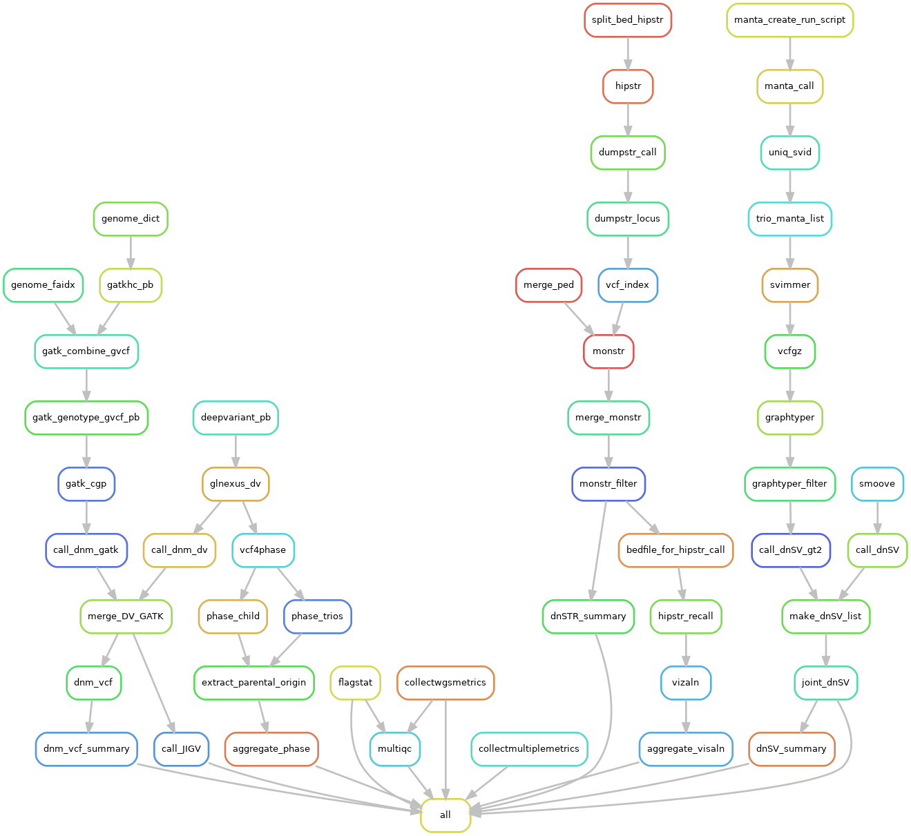

<!-- omit in TOC -->
# Snakemake workflow: TriosCompass

[](https://snakemake.github.io)


A Snakemake workflow for DNM (de novo mutation) calling.

---

- [Snakemake workflow: TriosCompass](#snakemake-workflow-trioscompass)
  - [Overview](#overview)
    - [I. Introduction](#i-introduction)
    - [II. Dependencies](#ii-dependencies)
    - [III. Methods](#iii-methods)
      - [A. Call DNMs](#a-call-dnms)
      - [Updated DNM calling](#updated-dnm-calling)
        - [New slivar filtering](#new-slivar-filtering)
        - [New config setting for high coverage (~80X)](#new-config-setting-for-high-coverage-80x)
        - [New config setting for moderate coverage (~40X)](#new-config-setting-for-moderate-coverage-40x)
      - [B. Phase DNMs](#b-phase-dnms)
      - [C. Call dnSTRs](#c-call-dnstrs)
      - [D. Call dnSVs](#d-call-dnsvs)
  - [User's guides](#users-guides)
    - [I. Installation](#i-installation)
    - [II. Inputs](#ii-inputs)
      - [Reference genome](#reference-genome)
      - [Preparation of the callable regions of DNMs](#preparation-of-the-callable-regions-of-dnms)
      - [The STR reference panel to call dnSTRs](#the-str-reference-panel-to-call-dnstrs)
      - [Regions excluded in dnSTR calling](#regions-excluded-in-dnstr-calling)
      - [Regions excluded in dnSV calling](#regions-excluded-in-dnsv-calling)
      - [Resource bundle for hg38](#resource-bundle-for-hg38)
      - [Fastq and BAM input files](#fastq-and-bam-input-files)
        - [PEP example for *fastq* input](#pep-example-for-fastq-input)
        - [PEP example for *bam* input](#pep-example-for-bam-input)
      - [Pedigree files](#pedigree-files)
      - [Example folder structure of the final workspace](#example-folder-structure-of-the-final-workspace)
    - [III. Configure files](#iii-configure-files)
      - [profile/config.yaml](#profileconfigyaml)
      - [config/config.yaml](#configconfigyaml)
    - [V. Run TriosCompass](#v-run-trioscompass)
    - [IV. Outputs](#iv-outputs)
      - [MultiQC report](#multiqc-report)
      - [DNM predictions, parental origins and visualizations](#dnm-predictions-parental-origins-and-visualizations)
        - [DNM predictions](#dnm-predictions)
        - [Parental origins of DNMs](#parental-origins-of-dnms)
        - [JIGV visulization](#jigv-visulization)
      - [dnSTR predictions and visulizations](#dnstr-predictions-and-visulizations)
        - [dnSTR predictions from HipSTR/MonSTR](#dnstr-predictions-from-hipstrmonstr)
        - [dnSTR visulizations by *VizAln*](#dnstr-visulizations-by-vizaln)
          - [Example of VizAln realignment of the DNM (started at chr6:38571975) in the family *t0612*](#example-of-vizaln-realignment-of-the-dnm-started-at-chr638571975-in-the-family-t0612)
      - [dnSV predictions](#dnsv-predictions)
      - [Snakemake report for TriosCompass](#snakemake-report-for-trioscompass)
    - [V. Test dataset](#v-test-dataset)
      - [Uncompressing the Zip File](#uncompressing-the-zip-file)
      - [Installation](#installation)
      - [Configuring the Snakemake Profile](#configuring-the-snakemake-profile)
      - [Expected Output](#expected-output)

---


## Overview

### I. Introduction
*TriosCompass* consists of four functional components:
+ Call DNMs (de novo mutations) using *DeepVariant* and *GATK HaplotypeCaller*
+ Phase DNMs using *whatshap*
+ Call dnSTR (de novo simple tandem repeats) using HipSTR and MonSTR
+ Call dnSV (de novo structural variants) using *Manta*, *GraphType2* and *smoove*

The overall workflow diagram of *TriosCompass* is as below: 


---

### II. Dependencies

All required bioinformatics tools are wrapped as conda, container and etc, so TriosCompass is portable and easy to be deployed.

Nevertheless, there are still some basic dependencies required to start any Snakemake workflow (e.g., conda and python), which have been specified in [environment.yaml](https://github.com/NCI-CGR/TriosCompass_v2/blob/main/environment.yaml).  Users can create a new *conda* env for TriosCompassV2: 
```bash

mamba env create -f environment.yaml

conda activate TriosCompassV2
```

Besides, singularity needs to be installed globally, and the details of the TriosCompass installation can be found [below](#i-installation).  

### III. Methods
#### A. Call DNMs

The DNM candidates are jointly called by both *DeepVariant (DV)* and *GATK HaplotypeCaller (HC)* in the specified callable regions, then filtered using [sliver](https://github.com/brentp/slivar):

```bash
 "denovo:( \
      ( \
          (variant.CHROM == 'chrX' && kid.sex=='male') && \
          kid.hom_alt && kid.AB > 0.98  \
      ) || \
      ( \
          (!(variant.CHROM == 'chrX' && kid.sex=='male')) && \
          kid.het && kid.AB > 0.25 && kid.AB < 0.75 \
      ) \
      ) &&  (kid.AD[0]+kid.AD[1]) >= {params.min_dp}/(1+(variant.CHROM == 'chrX' && kid.sex == 'male' ? 1 : 0)) && \
      mom.hom_ref && dad.hom_ref \
          && (mom.AD[1] + dad.AD[1]) <= 5 \
          && kid.GQ >= {params.min_gq} && mom.GQ >= {params.min_gq} && dad.GQ >= {params.min_gq} \
          && (mom.AD[0]+mom.AD[1]) >= {params.min_dp} && (dad.AD[0]+dad.AD[1]) >= {params.min_dp}/(1+(variant.CHROM == 'chrX' ? 1 : 0))"
```

+ (!(variant.CHROM == 'chrX' && kid.sex=='male')) && kid.het && kid.AB > 0.25 && kid.AB < 0.75
  + In the normal cases, select variants with genotype of "0/1" and allele balance in the range of 0.25 and 0.75.
+ (variant.CHROM == 'chrX' && kid.sex=='male') && alt && kid.AB > 0.98
  + In the special case (that is, variant in chrX in the male offspring), select variants with the genotype of "1/1" and allele balance > 0.98.
+ (kid.AD[0]+kid.AD[1]) >= {params.min_dp}/(1+(variant.CHROM == 'chrX' && kid.sex == 'male' ? 1 : 0))
  + The kid's variant should have depth over the minimal read depth *{params.min_dp}*. If the variant is on chrX and the kid's gender is male, the minimum read depth requirement is reduced to its half.
+ (mom.AD[0]+mom.AD[1]) >= {params.min_dp} && (dad.AD[0]+dad.AD[1]) >= {params.min_dp}/(1+(variant.CHROM == 'chrX' ? 1 : 0))
  + Similar read depth requirement is also applied for the parents.
+ mom.hom_ref && dad.hom_ref
  + The genotypes of the parents should both be "0/0";
+ (mom.AD[1] + dad.AD[1]) <= 5
  + The total read support of the alternative allele (that is, the DNM) should be not bigger than 5 in parents.
+ kid.GQ >= {params.min_gq} && mom.GQ >= {params.min_gq} && dad.GQ >= {params.min_gq}
  + GQ score of the variants should be no less than {params.min_gq} in all the members of the trio.

<font size="+3">&#128214;</font> In the workflow, the parameters {params.min_dp} and {params.min_gq} can be configured via config/config.yaml, so are the callable regions:

+ config/config.yaml

    ```yml
    call_dnm:
      interval: "ref/hg38.wgs_interval.bed" # DNM callable regions
      dv:
        min_gq: 3
        min_dp: 20
      hc:
        min_gq: 20
        min_dp: 30
    ```
---

#### Updated DNM calling
We observed GQ scores from DeepVariant vary depending on the read depth and genotype, so we refined DNM calling accordingly.  The GQ scores might be improved in the future release of DeepVariant.

##### New slivar filtering
```bash
"denovo:( \
                ( \
                    (variant.CHROM == 'chrX' && kid.sex=='male') && \
                    ((kid.GQ >= {params.min_01_gq} && kid.hom_alt) || \
                     (kid.PL[0]>={params.min_PL} && kid.PL[1]>={params.min_PL} && kid.PL[2]==0)) \
                    && kid.AB > 0.98  \
                ) || \
                ( \
                    (!(variant.CHROM == 'chrX' && kid.sex=='male')) && \
                    ((kid.GQ >= {params.min_01_gq} && kid.het) || \
                     (kid.PL[0]>={params.min_PL} && kid.PL[2]>={params.min_PL} && kid.PL[1]==0)) \
                    && kid.AB > {params.AB} && kid.AB < 1-{params.AB} \
                ) \
                ) &&  (kid.AD[0]+kid.AD[1]) >= {params.min_dp}/(1+(variant.CHROM == 'chrX' && kid.sex == 'male' ? 1 : 0)) && \
                (kid.AD[0]+kid.AD[1]) < {params.max_dp}/(1+(variant.CHROM == 'chrX' && kid.sex == 'male' ? 1 : 0)) && \
                ((mom.GQ >= {params.min_00_gq} && mom.hom_ref) || \
                 (mom.PL[0]==0 && mom.PL[1]>={params.min_PL} && mom.PL[2]>={params.min_PL})) && \
                ((dad.GQ >= {params.min_00_gq} && dad.hom_ref) || \
                 (dad.PL[0]==0 && dad.PL[1]>={params.min_PL} && dad.PL[2]>={params.min_PL})) \
                    && (mom.AD[1]/(mom.AD[0]+mom.AD[1])) < {params.max_err} \
                    && (dad.AD[1]/(dad.AD[0]+dad.AD[1])) < {params.max_err} \
                    && (mom.AD[0]+mom.AD[1]) >= {params.min_dp} && (mom.AD[0]+mom.AD[1]) < {params.max_dp} && (dad.AD[0]+dad.AD[1]) >= {params.min_dp}/(1+(variant.CHROM == 'chrX' ? 1 : 0)) && (dad.AD[0]+dad.AD[1]) < {params.max_dp}/(1+(variant.CHROM == 'chrX' ? 1 : 0)) "
```

##### New config setting for high coverage (~80X)
```yml
call_dnm:
  interval: "ref/hg38.wgs_interval.bed"
  max_err: 0.02 # max AF for parenets (AD[1]/AD) 
  AB: 0.3 # allele balance is btwn (AB, 1-AB)
  dv:
    min_00_gq: 20
    min_01_gq: 3 # 3 for high depth
    min_dp: 20
    max_dp: 250
    min_PL: 20
  hc:
    min_00_gq: 20
    min_01_gq: 20
    min_dp: 30
    max_dp: 250
    min_PL: 20
```

##### New config setting for moderate coverage (~40X)
```yml
call_dnm:
  interval: "ref/hg38.wgs_interval.bed"
  max_err: 0.02 # max AF for parenets (AD[1]/AD) 
  AB: 0.25 # allele balance is btwn (AB, 1-AB)
  dv:
    min_00_gq: 20
    min_01_gq: 15 # 3 for high depth
    min_dp: 15
    max_dp: 125
    min_PL: 20
  hc:
    min_00_gq: 20
    min_01_gq: 20
    min_dp: 15
    max_dp: 125
    min_PL: 20
```

---
#### B. Phase DNMs
We identified parental origin of DNMs using [*WhatsHap*](https://github.com/whatshap/whatshap). 

There are two running modes in WhatsHap: individual and pedigree. In the individual mode, variants are phased into haplotype blocks by *WhatsHap*, without parental origin information.  Pedigree mode is ideal to identify parental origin of variants in the child.  However, WhatsHap does not phase DNMs in the pedigree mode, as DNMs do not follow mendelian inheritance. Therefore, phasing DNMs is not supported by WhatsHap at present (see this [issue](https://github.com/whatshap/whatshap/issues/82) for the details). Nevertheless, a DNM could be phased with the other informative germline variants into the same haplotype block in the individual mode, and thereby all variants in the block share the same parental origin.  Therefore, we managed to run WhatsHap in both individual mode and pedigree mode, and extract parental original from the two outputs.

We first explored to run WhatsHap on the whole genome using the workflow [Snakefile_whatshap_WG](https://github.com/NCI-CGR/TriosCompass_v2/blob/8trios/Snakefile_whatshap_WG).  It turns out to be very slow: it took up to 7 days to process one trio family, and 2-3 days for each trio in average.  Finally,  we chose to phase a 10 Kb window around each DNM. 


We developed [a Perl script](https://github.com/NCI-CGR/TriosCompass_v2/blob/main/workflow/scripts/extract_parental_origin.pl) to identify the parental origin, and the aggregated results are output to the file: output/phase_DNMs/{Trios_ID}.parental_origin.tab.  The output file is a tab delimited text file, with 9 columns including variant id of DNM, parental origin prediction.  

The perl script extracts the haplotype block containing the DNMs from the output of WhatsHap phasing child (i.e., the individual mode), and collects the phased variants of child in the block.  The script also repeats the processing on the output of WhatsHap phasing trios.  The phase prediction from the latter is given as *F|M*, i.e, the first allele is the one inherited from the father (F) and the other in inherited from the mother (M). However, the parental origin prediction from the individual mode is not certain, that is, it could be F|M or M|F. Ideally, the phases of the variants in each haplotype block from WhatsHap phasing child only should be either all identical (FM count) or all opposite (MF count) to those from WhatsHap phasing trios. In such cases, we can certainly identify the parental origin of the block and so is that of the DNM in the same block.   We simply assign parental origin as *Not Determined* (ND) if there is inconsistency of FM statuses among the variants in the same block (i.e., both FM count > 0 and MF count > 0). 

+ Example of the output of extract_parental_origin.pl
  
| VariantID                        | Parental Origin | Phase | Haplotype Block Size | # Informative Sites | FM count | MF count | FM status | Parent origin change |
|----------------------------------|-----------------|-------|----------------------|---------------------|----------|----------|-----------|----------------------|
| chr1:208903875:G:A               | ND              | 1\|0  | 36                   | 0                   | 25       | 11       | ND        | ND=>ND               |
| chr2:12194398:A:C                | paternal        | 1\|0  | 2                    | 2                   | 2        | 0        | FM        | paternal=>paternal   |
| chr2:14986429:A:T                | paternal        | 1\|0  | 5                    | 5                   | 5        | 0        | FM        | paternal=>paternal   |
| chr2:50677044:C:T                | ND              | 0/1   | 0                    | 0                   | 0        | 0        | ND        | ND=>ND               |
| chr2:139840973:T:A               | paternal        | 0\|1  | 14                   | 14                  | 0        | 14       | MF        | paternal=>paternal   |
| chr2:154745781:T:C               | ND              | 0/1   | 0                    | 0                   | 0        | 0        | ND        | ND=>ND               |
| chr2:203705880:T:TTCTTTC         | ND              | 0/1   | 0                    | 0                   | 0        | 0        | ND        | ND=>ND               |
| chr2:220449146:A:G               | ND              | 0/1   | 0                    | 0                   | 0        | 0        | ND        | ND=>ND               |
| chr3:14911256:G:C                | ND              | 0/1   | 0                    | 0                   | 0        | 0        | ND        | ND=>ND               |
| chr3:76410708:A:C                | ND              | 0/1   | 0                    | 0                   | 0        | 0        | ND        | ND=>ND               |
| chr3:185020246:C:T               | ND              | 0/1   | 0                    | 0                   | 0        | 0        | ND        | ND=>ND               |
| chr3:194728646:G:GTGTGTGTGTGTGTC | maternal        | 0\|1  | 6                    | 6                   | 6        | 0        | FM        | maternal=>maternal   |
| chr3:197879976:C:T               | paternal        | 0\|1  | 3                    | 2                   | 0        | 1        | MF        | paternal=>paternal   |
| chr3:197879978:C:A               | paternal        | 0\|1  | 3                    | 2                   | 0        | 1        | MF        | paternal=>paternal   |
| chr4:29657055:GC:G               | ND              | 0/1   | 0                    | 0                   | 0        | 0        | ND        | ND=>ND               |

<font size="+3">&#128214;</font> For most users, the first two columns provide essential information about parental origins of the predicted DNMs.


+ Descriptions for each output column.


| Column position | Column Header          | Description                                                   | Notes                                                                                                                |
|-----------------|------------------------|---------------------------------------------------------------|----------------------------------------------------------------------------------------------------------------------|
| 1               | VariantID              | Variant ID of DNM                                             |                                                                                                                      |
| 2               | Parental Origin        | Predicted parental origin                                     | ND (not determined)                                                                                                  |
| 3               | Phase                  | Phased genotype of DNMs (from phasing child)                  | Parental origin cannot be determined from the output from phasing child only.                                        |
| 4               | Haplotype Block Size   | Size of the haplotype block (from phasing child)              | Prediction from a large block is more reliable.                                                                      |
| 5               | # Informative Sites    | # informative sites in the haplotype block                    | Prediction is not reliable if # informative sites is 0.                                                              |
| 6               | FM count               | # phased variants supporting F\|M genotype                    |                                                                                                                      |
| 7               | MF count               | # phased variants supporting M\|F genotype                    |                                                                                                                      |
| 8               | FM status              | FM (for F\|M), MF (for M\|F), ND (not determined)             | FM status is ND if both FM and MF counts are bigger than 0.                                                          |
| 9               | Parental origin change | Prediction (wo phasing trios) => Prediction(wi phasing trios) | Generally, the prediction with phasing child only is consistent with that with both phasing child and phasing trios. |


+ config.yaml setting for phasing
    ```yml
    phasing:
      window_size: 10000
      # the perl script path relative to the working directory
      perl_cmd: "perl TriosCompass_v2/workflow/scripts/extract_parental_origin.pl "
    
    ```

---

#### C. Call dnSTRs

We had explored to call dnSTR candidates jointly by *HipSTR* and *GangSTR*. During the manual curation, we found that the joint predicts are good but much fewer than expected, and the HipSTR outperforms GangSTR in our manual evaluation.  Therefore, we gave up *GangSTR*, and employed *HipSTR/MonSTR* in the dnSTR prediction.

At present, our dnSTR calling process is as below:
1. The STR reference panel is split into *N* chunks.
2. For each chunk:
   a. STRs of all samples (from different trios) are jointly genotyped by *HipSTR*.
   b. Then, to be filtered by *dumpSTR*.
   c. *MonSTR* is applied to call dnSTRs.
3. Chunks of *MonSTR* is merged and then filtered further.

Besides, *VizAln* (from the *HipSTR* package) is employed to generated visualization in HTML format.
 
Below is the configure setting for dnSTR in config/config.yaml:
```yml
dnSTR:
  # split bed into chunks to speed up dnSTR call
  split_n: 400
  dup_reg: "ref/STR/GRCh38GenomicSuperDup.bed.gz" # come with GRCh38GenomicSuperDup.bed.gz.tbi 
  hipstr:
    enable: True
    ref_panel: "ref/STR/hg38_ver13.hipstr_9.bed"
    monstr_filter: " --min-span-coverage 3 --min-supp-reads 3 "
    dumpstr_call_args: >
            --hipstr-min-call-DP 15 
            --hipstr-max-call-DP 1000 
            --hipstr-min-call-Q 0.9 --drop-filtered 
            --vcftype hipstr --hipstr-min-supp-reads 1 
            --hipstr-max-call-flank-indel 0.15 
            --hipstr-max-call-stutter 0.15 
  # gangstr:
  #   enable: False
  #   ref_panel: "ref/STR/hg38_ver13.le9.bed"
  #   filter: " --max-perc-encl-parent 0.05 --min-encl-match 0.9 --min-total-encl 10 --gangstr "
```


---

#### D. Call dnSVs
dnSVs are predicted jointly by two approaches in TriosCompass:
+ [smoove/lumpy-sv](https://github.com/brentp/smoove)
+ manta + GraphType2  


<font size="+3">&#128214;</font> Please note: 
+ Insertion is marked as translocation (i.e., "BND") in [smoove/lumpy-sv](https://github.com/arq5x/lumpy-sv/issues/160).
+ Bam files (not *cram*) are recognized by *lumpy-sv*.
+ Sample order in the ped file matters.  
  
  By default, we had built ped files in the order as: father, mother, and child. Accordingly, the same order is remained in the jointly genotyped SV VCF file. Therefore, we used the *bcftools* command to identify dnSV as below:

    ```bash
    bcftools view -i 'GT[2]="het" && GT[1]="RR" && GT[0]="RR" ' -O v  {input} -o {output}
    ``` 

---

## User's guides

### I. Installation 
+ Install singularity globally.
+ Install conda and mamba.
+ Create the workspace directory \$WORKSPACE and change directory to \$WORKSPACE.
+ Git clone the TriosCompass_v2 repository.
  ```bash
  git clone https://github.com/NCI-CGR/TriosCompass_v2.git
  ```
+ Create new conda environment to run Snakemake workflow
  ```bash
  mamba env create -f TriosCompass_v2/environment.yaml
  ``` 
  
Folder structure of your workspace is as follows:
```bash
$WORKSPACE
└── TriosCompass_v2
```
 
### II. Inputs
#### Reference genome

User can put the reference genome any location under the folder $WORKSPACE and specify its relative location at config/config.yaml.  

For instance, we may put the hg38 human genome *Homo_sapiens_assembly38.fasta* under the folder $WORKSPACE/ref/. 

+ config/config.yaml

    ```yml
    ref:
      sequence: "ref/Homo_sapiens_assembly38.fasta"
      build: "hg38"
    ```

---

#### Preparation of the callable regions of DNMs

The interval file (in *bed* format) is to specify regions to call DNMs, which should be matched with the reference genome.  For instance, we used the file hg38.wgs_interval.bed for the reference genome *hg38*, which was converted from *resources_broad_hg38_v0_wgs_calling_regions.hg38.interval_list*. The latter is part of [resource bundle hosted by the Broad Institute](https://gatk.broadinstitute.org/hc/en-us/articles/360035890811-Resource-bundle). There are severals way to retrieve the interval file, for example, ftp://gsapubftp-anonymous@ftp.broadinstitute.org/bundle/hg38/wgs_calling_regions.hg38.interval_list.

```bash
### Download calling region of hg38 from the Broad Institute 
wget https://storage.googleapis.com/genomics-public-data/resources/broad/hg38/v0/wgs_calling_regions.hg38.interval_list -O ref/resources_broad_hg38_v0_wgs_calling_regions.hg38.interval_list

### Then, convert the interval list to bed file using Picard
module load picard 

java -jar $PICARDJAR IntervalListToBed -I ref/resources_broad_hg38_v0_wgs_calling_regions.hg38.interval_list -O ref/hg38.wgs_interval.bed

```

Users can specify ref/hg38.wgs_interval.bed in config/config.yaml
```yml
call_dnm:
  interval: "ref/hg38.wgs_interval.bed"
```
---

#### The STR reference panel to call dnSTRs

We had developed joint call of dnSTR using both GangSTR and HipSTR, so we had prepared the same STR reference panels for both of the two programs.

Both GangSTR and HipSTR use STRs specified in the STR reference panel, but with the different formats.  One paper suggested that there is good consistence between HipSTR and GangSTR.
>Oketch, J. W., Wain, L. V, Hollox, E. J., & Hollox, E. (2022). A comparison of software for analysis of rare and common short tandem repeat (STR) variation using human genome sequences from clinical and population-based samples. 1–22. https://doi.org/10.1101/2022.05.25.493473


We would like to have the STR genotypes predicted jointly by both of the two program, therefore we need create one common reference panel file for both of GangSTR and HipSTR. 

```bash
### Get the GangSTR reference panel
wget https://s3.amazonaws.com/gangstr/hg38/genomewide/hg38_ver13.bed.gz -O STR/hg38_ver13.bed.gz

gzip -d STR/hg38_ver13.bed.gz

### reformat for HipSTR
awk -v OFS='\t' '{print $1,$2,$3,$4,($3-$2+1)/$4,"GangSTR_STR_"NR,$5}' STR/hg38_ver13.bed  >  STR/hg38_ver13.hipstr.bed

### HipSTR cannot take STR with unit length > 9 bp
awk -v OFS='\t' '{if($4<=9) print $0}' STR/hg38_ver13.hipstr.bed > STR/hg38_ver13.hipstr_9.bed

### We put the same length restrict to hg38_ver13.bed.gz, so that both of the two reference panels are consistent.
awk -v OFS='\t' '{if($4<=9) print $0}' STR/hg38_ver13.bed > STR/hg38_ver13.le9.bed
```


<font size="+3">&#128214;</font> 
+ After manual curation, we chose to use *HipSTR* only for the dnSTR prediction.
+ The STR reference panel is specified in config/config.yaml
  + ref_panel: "ref/STR/hg38_ver13.hipstr_9.bed"

---

#### Regions excluded in dnSTR calling
For the human genome hg38, the file GRCh38GenomicSuperDup.bed was obtained using the UCSC Table Browser (hg38.genomicSuperDups table).  It needs to be further sorted, compressed and indexed as shown below:

```bash
bedtools sort -i GRCh38GenomicSuperDup.bed | bgzip -c > GRCh38GenomicSuperDup.bed.gz

tabix -p bed GRCh38GenomicSuperDup.bed.gz
```

+ The setting can also be customized in config/config.yaml

    ```yml
    dnSTR:
      # split bed into chunks to speed up dnSTR call
      split_n: 400
      dup_reg: "ref/STR/GRCh38GenomicSuperDup.bed.gz" # come with GRCh38GenomicSuperDup.bed.gz.tbi 
    ```

---

#### Regions excluded in dnSV calling
We used exclude.cnvnator_100bp.GRCh38.20170403.bed for regions to be excluded in dnSV calling, as suggested at [brentp/smoove](https://github.com/brentp/smoove?tab=readme-ov-file#small-cohorts-n---40):

```bash
wget https://raw.githubusercontent.com/hall-lab/speedseq/master/annotations/exclude.cnvnator_100bp.GRCh38.20170403.bed -O ref/exclude.cnvnator_100bp.GRCh38.20170403.bed
```

+ Settings in config.yaml

    ```yml
    dnSV:
      enable: True
      exclude_bed: "ref/exclude.cnvnator_100bp.GRCh38.20170403.bed"
    ```

---

#### Resource bundle for hg38

After the installation of the above resource files required by TriosCompass to *ref/*, users may have the folder ref/ under $WORKSPACE as below:

```bash
$WORKSPACE/ref
├── exclude.cnvnator_100bp.GRCh38.20170403.bed
├── hg38.wgs_interval.bed
├── Homo_sapiens_assembly38.fasta
└── STR
    ├── GRCh38GenomicSuperDup.bed.gz
    ├── GRCh38GenomicSuperDup.bed.gz.tbi
    ├── hg38_ver13.bed
    ├── hg38_ver13.hipstr_9.bed
    └── hg38_ver13.le9.bed
```

A resource bundle for hg38 is available at [here](https://zenodo.org/uploads/13381196) as a reference for users of TriosCompass.

---

#### Fastq and BAM input files

[PEP](https://pep.databio.org/) is employed to import metadata of the NGS data, which can be either Fastq or BAM files. A PEP usually consists 3 files: 
+ One *yaml* file for the metadata.
+ One *csv* file for the sample information.
+ Another *yaml* (optional) to define schema to validate the metadata.

##### PEP example for *fastq* input
+ config/fastq_pep.yaml

    ```yml
    pep_version: 2.0.0
    sample_table: sample_fastq.csv
    
    # In manifest file, Sample_ID + Flowcell should be unique
    sample_modifiers:
      append:
        sample_name: "sn"
      derive:
        attributes: [sample_name]
        sources:
          sn: "{SAMPLE_ID}_{FLOWCELL}"
    ```

+ config/sample_fastq.csv

    ```csv
    SAMPLE_ID,FLOWCELL,LANE,INDEX,R1,R2
    HG002,BH2JWTDSX5,1,CGGTTGTT-GTGGTATG,data/fq/HG002_NA24385_son_80X_R1.fq.gz,data/fq/HG002_NA24385_son_80X_R2.fq.gz
    HG003,BH2JWTDSX5,1,GCGTCATT-CAGACGTT,data/fq/HG003_NA24149_father_80X_R1.fq.gz,data/fq/HG003_NA24149_father_80X_R2.fq.gz
    HG004,BH2JWTDSX5,1,CTGTTGAC-ACCTCAGT,data/fq/HG004_NA24143_mother_80X_R1.fq.gz,data/fq/HG004_NA24143_mother_80X_R2.fq.gz
    ```

+ workflow/schemas/fastq_schema.yaml

    ```yml
    description: A example schema for a pipeline.
    imports:
      - http://schema.databio.org/pep/2.0.0.yaml
      # - TriosCompass_v2/workflow/schemas/2.0.0.yaml
      
    properties:
      samples:
        type: array
        items:
          type: object
          properties:
            SAMPLE_ID:
              type: string
              description: "sample id"
            FLOWCELL:
              type: string
              description: "Flowcell"
            INDEX:
              type: string
              description: "Library index"
            LANE:
              type: string
              description: "Lane number in flowcell"
              enum: ["1", "2"]
            R1:
              type: string
              description: "path to the R1 fastq file"
            R2:
              type: string
              description: "path to the R2 fastq file"
          required:
            - FLOWCELL
            - SAMPLE_ID
            - INDEX
            - R1
            - R2
    ```

<font size="+3">&#128214;</font> In this example, 6 columns in the sample csv file are required: SAMPLE_ID, FLOWCELL, LANE, INDEX, R1, R2. Such information is mainly used to build RG (read group) tag in the bam file:  

```
@RG    PL:ILLUMINA    ID:{FLOWCELL}_{LANE}    SM:{SAMPLE_ID}    PU:{SAMPLE_ID}_{FLOWCELL}    LB:{SAMPLE_ID}_{INDEX}
```
Users may put dummy data if some of the information is not available, and {SAMPLE_ID} needs not to be unique in the sample table (as some samples might be sequenced in multiple flow cells to meet the coverage requirement).  Nevertheless, the combination of {SAMPLE_ID} and {FLOWCELL} must be unique.

Users may put additional meta information in the sample csv file, which, however, will be ignored by TriosCompass.

##### PEP example for *bam* input

The essential information for bam input is the sample id and the bam file location. Therefore, the metadata is much simpler compared to *fastq* input.

+ config/bam_pep.yaml

    ```yml
    pep_version: 2.0.0
    sample_table: sample_bam.csv
    
    
    sample_modifiers:
      append:
        sample_name: "sn"
      derive:
        attributes: [sample_name]
        sources:
          sn: "{SAMPLE_ID}"
    ```

+ config/sample_bam.csv
  
    ```csv
    SAMPLE_ID,BAM
    HG002,sorted_bam/HG002_NA24385_son_80X.bam
    HG003,sorted_bam/HG003_NA24149_father_80X.bam
    HG004,sorted_bam/HG004_NA24143_mother_80X.bam
    ```

+ workflow/schemas/bam_schema.yaml
    ```yml
    description: A example schema for a pipeline.
    imports:
      - http://schema.databio.org/pep/2.0.0.yaml
      # - TriosCompass_v2/workflow/schemas/2.0.0.yaml
      
    properties:
      samples:
        type: array
        items:
          type: object
          properties:
            SAMPLE_ID:
              type: string
              description: "sample id"
            BAM:
              type: string
              description: "path to the bam file"
          required:
            - SAMPLE_ID
            - BAM
    ```

<font size="+3">&#128214;</font> {SAMPLE_ID} should be unique and matched with the RG tag in the bam file in *TriosCompass*.  If the bam file has *RG* different from {SAMPLE_ID}, users may activate *reset_RG* option so as to update all *RG* tag properly in the bam files.

+ config/config.yaml
```yml
bam_input:
  reset_RG: True
```

---

#### Pedigree files
In addition to the NGS input data, another important input is pedigree files to define trios. 

<font size="+3">&#128214;</font> There are several requirements about pedigree files from TriosCompass:
+ Each trio is specified by one pedigree file;
+ All pedigree files are named by the unique family ID, with ".ped" as the file extension, under the directory which is specified by config/config.yaml:
    ```yml
    ped_dir: "ped"
    ```
+ Rows for the trio members are in the order *father-mother-child* in the pedigree file.
+ Trio member identifiers are matched with {SAMPLE_ID} as defined in the sample CSV filem and also matched with the RG tags of the bam files.


Below is an example of the pedigree file for the GIAB AJ family:
+ ped/AJ.ped 
  
    ```tab
    AJ      HG003   0       0       1       1
    AJ      HG004   0       0       2       1
    AJ      HG002   HG003   HG004   1       1
    ```

---

#### Example folder structure of the final workspace
```bash
fastq/ # for fastq input example
├── HG002_NA24385_son_80X_R1.fq.gz
├── HG002_NA24385_son_80X_R2.fq.gz
├── HG003_NA24149_father_80X_R1.fq.gz
├── HG003_NA24149_father_80X_R2.fq.gz
├── HG004_NA24143_mother_80X_R1.fq.gz
└── HG004_NA24143_mother_80X_R2.fq.gz
sorted_bam/ # for bam input example
├── HG002_NA24385_son_80X.bam
├── HG002_NA24385_son_80X.bam.bai
├── HG003_NA24149_father_80X.bam
├── HG003_NA24149_father_80X.bam.bai
├── HG004_NA24143_mother_80X.bam
└── HG004_NA24143_mother_80X.bam.bai
ref/
├── hg38.wgs_interval.bed
├── Homo_sapiens_assembly38.fasta
└── STR/
ped/
└── AJ.ped
TriosCompass_v2
├── config/
├── data/
├── environment.yaml
├── img/
├── LICENSE
├── README.md
└── workflow/


```

---

### III. Configure files
We have introduced PEP yaml file to [specify the NGS input files of TriosCompass](#fastq-and-bam-input-files). There are two other yaml files, which play essential roles in Snakemake workflows:
+ the profile config.yaml file
+ the configfile config.yaml file

#### profile/config.yaml

The profile config.yaml file has [multiple function roles](https://snakemake.readthedocs.io/en/v7.3.7/executing/cli.html#profiles) in *Snakemake*: 
+ Define computing resources and threads.
+ Specify command-line options required to start Snakemake workflow properly. 
+ Submit Snakemake jobs to the cluster. 

We have provided [an example profile](https://github.com/NCI-CGR/TriosCompass_v2/blob/main/workflow/profiles/slurm/config.yaml) to launch TriosCompass in a Slurm cluster.

<font size="+3">&#128214;</font> To separate the workspace from TriosCompass, we set $WORKSPACE as the working directory, where TriosCompass_v2 (the locally cloned repo) is a sub-folder of $WORKSPACE.  Accordingly, the command below is recommended:
```bash
snakemake --profile TriosCompass_v2/workflow/profiles/slurm --configfile TriosCompass_v2/config/config.yaml
```

<font size="+3">&#128214;</font> There is a bug in the release of Snakemake we are testing (Version 7.3.7), so that the section *set-threads* does not work properly in the profile config.yaml file. We had used [config/config.yaml](#configconfigyaml) as a work-around solution to specify threads for each Snakemake *rule*. 

---

#### config/config.yaml

[This configure file](https://snakemake.readthedocs.io/en/v7.3.7/snakefiles/configuration.html?highlight=configfile#configuration) is for users to customized TriosCompass.  In particular, users may it to enable (or disable) certain optional components of TriosCompass. Most of sections of config.yaml have been already introduced in [the section *Inputs*](#ii-inputs).  [A complete example of config/config.yaml](https://github.com/NCI-CGR/TriosCompass_v2/blob/main/config/config.yaml) has been provided for users as a template.   

---

### V. Run TriosCompass

A check list to launch TriosCompass
- [ ] Install singularity to the front-end nodes and working nodes of the cluster.
- [ ] Create new directory as work space and change directory to it.
- [ ] Git clone TriosCompass_v2.
- [ ] Install conda/mamba and activate the conda environment *TriosCompassV2* using TriosCompass_v2/environment.txt
- [ ] Prepare and install resource bundle for the specific reference genome.
- [ ] Configure profile settings to submit jobs to the cluster.
- [ ] Move NGS input data under the work space.
  - [ ] Prepare the proper PEP files for the NGS input.
- [ ] Configure TriosCompass_v2/config/config.yaml for the new run.

Finally, the command can be launched in this way: 
```bash
### Assume $WORKSPACE is your working directory
cd $WORKSPACE
conda activate TriosCompassV2
module load singularity # or load singularity is available in alternative way

mkdir -p TMP
export TMPDIR=$WORKSPACE/TMP

snakemake  --profile TriosCompass_v2/workflow/profiles/slurm --configfile TriosCompass_v2/config/config.yaml
```

---

### IV. Outputs
The location of the *output* directory is also specified by config/config.yaml:

```yml
output_dir: "output"
```

Most of the output from TriosCompass will be saved to $WORKSPACE/output based on the configure setting above. Under the output folder, there are dozens of sub-folders for the (intermediate) outputs of TriosCompass.
```bash
ls $WORKSPACE/output/
benchmark               dnSV               gatk_genotype_gvcf_pb  manta_sv       splitted_panel
call_JIGV               dnSV_summary       gatkhc_pb              merge_monstr   svimmer
collectmultiplemetrics  dumpstr_call       glnexus                merge_ped      trio_manta_list
collectwgsmetrics       dumpstr_locus      graphtyper             monstr         vizaln
deepvariant_pb          flagstat           graphtyper_filter      monstr_filter
dnm_vcf                 gatk_cgp           hipstr                 phase_DNMs
dnm_vcf_summary         gatk_combine_gvcf  joint_dnSV             slivar
dnSTR_summary           GATK_DV            manta                  smoove
```


There are 4 major outputs from TriosCompass:
+ MultiQC reports
+ DNM predictions, parental origins and visualizations
+ dnSTR predictions and visulizations
+ dnSV predictions

#### MultiQC report
The MultiQC report is a colletion of QC metrics of NGS data.

Location of MultiQC output is specified by config["multiqc"]["output_dir"]:

```yml
multiqc:
  enable: True
  output_dir: "MultiQC_output"
```

```bash
tree MultiQC_output/
MultiQC_output/
├── multiqc_data
│   ├── multiqc_citations.txt
│   ├── multiqc_data.json
│   ├── multiqc_general_stats.txt
│   ├── multiqc.log
│   ├── multiqc_sources.txt
│   ├── picard_alignment_readlength_plot.txt
│   ├── picard_alignment_summary_Aligned_Bases.txt
│   ├── picard_alignment_summary_Aligned_Reads.txt
│   ├── picard_base_distribution_by_cycle__Adenine.txt
│   ├── picard_base_distribution_by_cycle__Cytosine.txt
│   ├── picard_base_distribution_by_cycle__Guanine.txt
│   ├── picard_base_distribution_by_cycle__Thymine.txt
│   ├── picard_base_distribution_by_cycle__Undetermined.txt
│   ├── picard_gcbias_plot.txt
│   ├── picard_insert_size_Counts.txt
│   ├── picard_insert_size_Percentages.txt
│   ├── picard_quality_by_cycle.txt
│   ├── picard_quality_score_distribution.txt
│   ├── samtools-flagstat-dp_Percentage_of_total.txt
│   ├── samtools-flagstat-dp_Read_counts.txt
│   ├── samtools-idxstats-mapped-reads-plot_Normalised_Counts.txt
│   ├── samtools-idxstats-mapped-reads-plot_Observed_over_Expected_Counts.txt
│   ├── samtools-idxstats-mapped-reads-plot_Raw_Counts.txt
│   └── samtools-idxstats-xy-plot.txt
└── multiqc.html
```

#### DNM predictions, parental origins and visualizations
##### DNM predictions
The final DNM candidates are predicted by both DV and HC.  And we extract the variant information from DV output and save it as {output}/dnm_vcf/{fam}.dnm.vcf.gz, where {output} and {fam} are placeholders for the output directory and trio ID, respecitively.

Besides, the counts of DNMs for all trios are summarised in the file {output}/dnm_vcf_summary/DNM_summary.txt.

##### Parental origins of DNMs

The output of parental origins of DNMs is a tab-delimited test file, availalbe at *{output}/phase_DNMs/{fam}.parental_origin.tab* .  

The format of this output is [as described](#b-phase-dnms), and most of users may just focus on first two columns of the file.

##### JIGV visulization
[JIGV](https://github.com/brentp/jigv) snapshots have generated for each DNM, available as *{output}/call_JIGV/{fam}.JIGV.html* .

---

#### dnSTR predictions and visulizations
##### dnSTR predictions from HipSTR/MonSTR
The dnSTRs predicted by HipSTR/MonSTR are available as *{output}/monstr_filter/hipstr.filtered.tab* . The output format of the MonSTR prediction is described [here](https://github.com/gymreklab/STRDenovoTools?tab=readme-ov-file#outprefixall_mutationstab).

##### dnSTR visulizations by *VizAln*
We have also generated visulization for dnSTR using [VizAln (from HipSTR package)](https://github.com/tfwillems/HipSTR#alignment-visualization). Each dnSTR of one trio has its own html file under *{output}/vizaln/{fam}/hipstr/variants/*.

```bash
tree output/vizaln/t0311/hipstr
output/vizaln/t0311/hipstr
├── DONE
└── variants
    ├── chr10_103294239.dnm
    ├── chr10_103294239.html
    ├── chr10_34375054.dnm
    ├── chr10_34375054.html
    ├── chr10_46899557.dnm
    ├── chr10_46899557.html
    ├── chr10_50707597.dnm
    ├── ...
```

<font size="+3">&#128214;</font> The ".dnm" files are dummy files for the use of Snakemake workflow in the process of scatter-gather dnSTRs.

###### Example of VizAln realignment of the DNM (started at chr6:38571975) in the family *t0612*

An example of VizAln realignment is available [here](https://htmlpreview.github.io/?https://github.com/NCI-CGR/TriosCompass_v2/blob/main/data/chr6_38571975.html).

In this particular example, the identifiers of child, father and mother are SC260721, SC260720 and SC260670, respectively, from the family *t0612*.
```bash
cat ped_files/t0612.ped 
t0612   SC260720        0       0       1       1
t0612   SC260670        0       0       2       1
t0612   SC260721        SC260720        SC260670        2       1
```

From [the MonSTR prediction](https://github.com/NCI-CGR/TriosCompass_v2/blob/main/data/hipstr.filtered.tab), we have: 

| chrom | pos      | period | child    | newallele | mutsize | child_gt | mat_gt | pat_gt |
|-------|----------|--------|----------|-----------|---------|----------|--------|--------|
| 6     | 38571975 | 2      | SC260721 | 13        | 2       | 13,13    | 11,13  | 11,11  |


It suggests there is an de novo tandem repeat mutation started at the position chr6:38571975 in the subject SC260721.  The unit length of repeat (period) is 2, and has 13 repeat units (newallele) in the child *SC260721*, which is 2 more than the reference genome (mutsize; i.e., the wild type genotype is [11,11]).  The MonSTR prediction indicated that the genotypes of child, father and mother are [13,13], [11,11] and [11,13], respectively. 

In the VizAln html page, we have genotypes of the family members marked in different ways.  For example, "SC260670: 0|4" means one allele is wild type and another is 4 bp insertion. Negative values stands for deletion (read [this](https://github.com/tfwillems/HipSTR/tree/master#alignment-visualization) for some details).  Therefore, "SC260721: 4|4", "SC260720: 0|0" and  "SC260670: 0|4" are well matched with the MonSTR prediction: [13,13], [11,11] and [11,13] for child, father and mother,respectively,  in this example.


<font size="+3">&#128214;</font> Please note that the alignments from VizAln were arranged by the alphabet order of the sample identifiers. 

---

#### dnSV predictions
As aforementioned, dnSVs are jointly predicted by *Smoove* and *Manta/TypeGraph2*.  The results are merged VCF files generated by *SURVIVOR*: {output}/joint_dnSV/{fam}.dnSV.vcf: 
+ output/joint_dnSV/t0311.dnSV.vcf
  
    ```tab
    #CHROM  POS     ID      REF     ALT     QUAL    FILTER  INFO    FORMAT  SC501095        SC501095_1
    chr18   55923597        chr18:55923597:OG       N       ]chr11:13001662]N    239     PASS    SUPP=2;SUPP_VEC=11;SVLEN=0;SVTYPE=TRA;SVMETHOD=SURVIVOR1.0.7;CHR2=chr11;END=13001651;CIPOS=-107,0;CIEND=0,11;STRANDS=++ GT:PSV:LN:DR:ST:QV:TY:ID:RAL:AAL:CO     0/1:NA:42921828:0,13:--:239:TRA:668279_2:NA:NA:chr18_55923490-chr11_13001662    0/1:NA:42921946:0,0:++:217:TRA:chr18_55923597_OG:NA:NA:chr18_55923597-chr11_13001651
    chr20   37068816        chr20:37068816:OG       N       ]chr11:5933976]N    255     PASS    SUPP=2;SUPP_VEC=11;SVLEN=0;SVTYPE=TRA;SVMETHOD=SURVIVOR1.0.7;CHR2=chr11;END=5933971;CIPOS=-32,0;CIEND=0,5;STRANDS=++    GT:PSV:LN:DR:ST:QV:TY:ID:RAL:AAL:CO     0/1:NA:31134808:0,20:-+:80:TRA:668295_2:NA:NA:chr20_37068784-chr11_5933976      0/1:NA:31134845:0,0:++:255:TRA:chr20_37068816_OG:NA:NA:chr20_37068816-chr11_5933971
    ```

<font size="+3">&#128214;</font> Two sample columns are available for the child (e.g.,SC501095) in the example vcf output: the first one is from *Smoove* and the other is from *Manta/TypeGraph2*

Besides, a summary of dnSV count is available as *{output}/dnSV_summary/dnSV_summary.txt*.

---

#### Snakemake report for TriosCompass
[Reports](https://snakemake.readthedocs.io/en/v7.3.7/snakefiles/reporting.html) is a very useful feature of Snakemake. We utilized this feature to package TriosCompass outputs into a zip file and index them with the HTMP page. 

Below is an example command to generate reports for TriosCompass: 

```bash
snakemake  --report TriosCompass_full_report.zip --profile TriosCompass_v2/workflow/profiles/slurm --configfile TriosCompass_v2/config/config.yaml
```

+ A snapshot of the report HTML page. 


---

### V. Test dataset

We've created [a test dataset](https://doi.org/10.5281/zenodo.7084147) to help you run the workflow, which includes the following components:

  * A resource bundle for the **GRCh38** human reference genome.
  * The **TriosCompass** workflow.
  * A small **BAM** file extracted from GIAB data (chr22:43000000-46000000).

The test dataset is available at https://doi.org/10.5281/zenodo.7084147 .

#### Uncompressing the Zip File
First, uncompress the provided zip file using the following command:

```bash
unzip TriosCompass_test_case.zip
```

Once uncompressed, the directory structure and file sizes are as follows:

```bash
du -hs test_case/*
220M    test_case/bam
1.3G    test_case/expected_output
3.0K    test_case/GIAB_40X.yaml
2.5K    test_case/input
512     test_case/launch_40X.sh
15G     test_case/ref
739M    test_case/TriosCompass_v2

ls -altr  test_case
total 4
drwxrwsr-x. 2 zhuw10 DCEG_Trios 4096 Feb 23  2025 input
-rwxrwxr-x. 1 zhuw10 DCEG_Trios  482 Feb 23  2025 launch_40X.sh
drwxrwsr-x. 2 zhuw10 DCEG_Trios 4096 Apr 25 10:35 ref
drwxrwsr-x. 2 zhuw10 DCEG_Trios 4096 Jul 28 14:16 TriosCompass_v2
drwxr-s---. 2 zhuw10 DCEG_Trios 4096 Aug 25 20:12 bam
-rwxrwxr-x. 1 zhuw10 DCEG_Trios 2839 Aug 26 09:09 GIAB_40X.yaml
drwxr-s---. 2 zhuw10 DCEG_Trios 4096 Aug 26 13:02 expected_output
drwxr-s---. 2 zhuw10 DCEG_Trios 4096 Aug 26 13:11 .
drwxrwsr-x. 2 zhuw10 DCEG_Trios 4096 Aug 26 13:25 ..
```

#### Installation

Before running the workflow, you'll need to install the following dependencies:

  * **Singularity**
  * **Conda** or **Mamba**
  * The **conda environment `TriosCompassV2`**

You can find detailed installation instructions in the [TriosCompass v2 documentation](https://github.com/NCI-CGR/TriosCompass_v2?tab=readme-ov-file#i-installation).

 

#### Configuring the Snakemake Profile

The TriosCompass workflow uses **Nvidia Parabricks**, which requires GPUs. These GPU requirements are specified in the Snakemake profiles for different computing environments, such as [SLURM](https://github.com/NCI-CGR/TriosCompass_v2/blob/main/workflow/profiles/slurm) and [SGE](https://github.com/NCI-CGR/TriosCompass_v2/tree/main/workflow/profiles/sge).

For example, the **SLURM** profile's `config.yaml` specifies these requirements:

```yaml
  - fq2bam:mem_mb=40000
  - fq2bam:runtime="8h"
  - fq2bam:partition=gpu
  - fq2bam:slurm=gres=gpu:v100x:1
```

You may need to adjust these settings based on your available computing resources. The `launch_40X.sh` file is an example script for running the workflow on the NIH Biowulf SLURM cluster, where `singularity` is loaded as a module.

```bash
#!/bin/bash
#SBATCH --time=200:00:00
#SBATCH -o ${PWD}/snakemake.%j.out
#SBATCH -e ${PWD}/snakemake.%j.err

### or make sure singularity is available in an alternative way
module load singularity

mkdir -p TMP
export TMPDIR=TMP

snakemake --profile TriosCompass_v2/workflow/profiles/slurm --configfile GIAB_40X.yaml --conda-frontend mamba
```

For instance, if you have `conda` and `singularity` installed on an SGE cluster, you could launch the workflow like this:

```bash
conda activate TriosCompassV2

mkdir -p TMP
export TMPDIR=TMP

snakemake --profile TriosCompass_v2/workflow/profiles/sge --configfile GIAB_40X.yaml --conda-frontend conda
```

-----

#### Expected Output

After the workflow successfully completes, you can generate a Snakemake report.

```bash
# Generate report
snakemake  --report GIAB_40X.report.zip --profile TriosCompass_v2/workflow/profiles/slurm --configfile GIAB_40X.yaml
```

The working directory will contain the expected output files:

```bash
ls -altr
total 1861
drwxrwsr-x 2 zhuw10 DCEG_Trios    4096 Feb 23  2025 input
-rwxrwxr-x 1 zhuw10 DCEG_Trios     482 Feb 23  2025 launch_40X.sh
drwxrwsr-x 2 zhuw10 DCEG_Trios    4096 Apr 25 10:35 ref
drwxrwsr-x 2 zhuw10 DCEG_Trios    4096 Jul 28 14:16 TriosCompass_v2
drwxrwsr-x 2 zhuw10 DCEG_Trios    4096 Aug 25 16:50 ..
drwxr-s--- 2 zhuw10 DCEG_Trios    4096 Aug 25 20:12 bam
-rwxrwxr-x 1 zhuw10 DCEG_Trios    2839 Aug 26 09:09 GIAB_40X.yaml
drwxr-s--- 2 zhuw10 DCEG_Trios    4096 Aug 26 11:34 MultiQC__40X_output
drwxr-s--- 2 zhuw10 DCEG_Trios    4096 Aug 26 11:45 benchmarks
drwxr-s--- 2 zhuw10 DCEG_Trios    4096 Aug 26 11:50 logs
drwxr-s--- 2 zhuw10 DCEG_Trios    4096 Aug 26 11:51 output_40X
drwxr-s--- 2 zhuw10 DCEG_Trios    4096 Aug 26 11:51 TMP
drwxr-s--- 2 zhuw10 DCEG_Trios    4096 Aug 26 11:51 .snakemake
-rw-r----- 1 zhuw10 DCEG_Trios  493518 Aug 26 11:51 slurm-65870893.out
drwxr-s--- 2 zhuw10 DCEG_Trios    4096 Aug 26 12:56 .

# We have copied the expected output to the subfolder expected_output/
mv MultiQC__40X_output benchmarks logs output_40X slurm-65870893.out GIAB_40X.report.zip expected_output/

ls -altr expected_output/
total 1857
drwxr-s---. 2 zhuw10 DCEG_Trios    4096 Aug 26 11:34 MultiQC__40X_output
drwxr-s---. 2 zhuw10 DCEG_Trios    4096 Aug 26 11:45 benchmarks
drwxr-s---. 2 zhuw10 DCEG_Trios    4096 Aug 26 11:50 logs
drwxr-s---. 2 zhuw10 DCEG_Trios    4096 Aug 26 11:51 output_40X
-rw-r-----. 1 zhuw10 DCEG_Trios  493518 Aug 26 11:51 slurm-65870893.out
-rw-r-----. 1 zhuw10 DCEG_Trios 1407748 Aug 26 12:56 GIAB_40X.report.zip
drwxr-s---. 2 zhuw10 DCEG_Trios    4096 Aug 26 13:02 .
drwxr-s---. 2 zhuw10 DCEG_Trios    4096 Aug 26 13:11 ..
```

The expected output is also available within the `TriosCompass_test_case.zip` file under the `test_case/expected_output/` subdirectory.