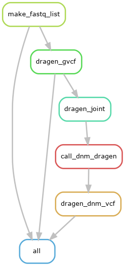

<!-- omit in toc -->
# Call DNMs using TriosCompass and Dragen (for NovaSeq benchmark)

--- 

- [Introduction](#introduction)
- [Methods](#methods)
  - [Call DNMs using TriosCompass](#call-dnms-using-trioscompass)
    - [DNM predictions from TriosCompass](#dnm-predictions-from-trioscompass)
    - [Benchmark of DNM predictions using hap.py](#benchmark-of-dnm-predictions-using-happy)
  - [Call DNMs using Dragen](#call-dnms-using-dragen)
    - [References](#references)
    - [Test to run dragen commands at Biowulf](#test-to-run-dragen-commands-at-biowulf)
    - [Build Snakemake workflow Snakefile\_dragen](#build-snakemake-workflow-snakefile_dragen)
    - [Call DNMs with Snakefile\_dragen](#call-dnms-with-snakefile_dragen)
    - [DNM predictions from Snakefile\_dragen](#dnm-predictions-from-snakefile_dragen)
  - [Benchmark of DNM predictions using hap.py](#benchmark-of-dnm-predictions-using-happy-1)
  - [Post-analyses](#post-analyses)
    - [MultiQC](#multiqc)
    - [VCF stats](#vcf-stats)


---

## Introduction

To benchmark the NGS data generated from Illumina NovaSeq, we explored calling DNMs from 3 trios using TriosCompass and Dragen: 1 GIAB trio (AJtrio) and 2 Chernobyl trios (t0311c1 and t0321c1).  The details of the project is available at [FogBugz](https://cgr-bugz.nci.nih.gov/f/cases/34832).

---

## Methods
### Call DNMs using TriosCompass
The deployment of TriosCompass is as described in [the user guide](https://github.com/NCI-CGR/TriosCompass_v2/tree/main?tab=readme-ov-file#applications-of-trioscompass-on-the-real-data), and we prepared several files to get started:
+ ped/ (pedigree files of 3 trios)
+ pep/
  + manifest_novaseq.csv
  + novaseq_config.yaml
+ schemas/novaseq_manifest_schema.yaml
+ Snakefile_novaseq
+ run_novaseq.sh

We launched the workflow Snakefile_novaseq with the wrapper bash script [run_novaseq.sh](./run_novaseq.sh):
```bash
conda activate snakemake
cd /data/DCEG_Trios/novaseq_benchmark/TriosCompass_v2

sbatch -J novaseq -t 200:00:00 --export=ALL --mem=12g -p norm  --wrap='./run_novaseq.sh '
```

#### DNM predictions from TriosCompass
The predicted DNM candidates are available under /data/DCEG_Trios/novaseq_benchmark/TriosCompass_v2/output/dnm_vcf/. 

#### Benchmark of DNM predictions using hap.py
+ happy_out/
  + [AJtrio.summary.csv](https://github.com/NCI-CGR/TriosCompass_v2/blob/novaseq/happy_out/AJtrio.summary.csv)
  + [t0311c1.summary.csv](https://github.com/NCI-CGR/TriosCompass_v2/blob/novaseq/happy_out/t0311c1.summary.csv)
  + [t0321c1.summary.csv](https://github.com/NCI-CGR/TriosCompass_v2/blob/novaseq/happy_out/t0321c1.summary.csv)
```bash
module load bcftools rtg-tools hap.py

mkdir happy_out

export GIAB=/vf/users/DCEG_Chernobyl/NP0436-HE5/GIAB_DATA/giab_snakeflow
hap.py $GIAB/giab_output/AJtrio_truth.vcf.gz \
   output/dnm_vcf/AJtrio.dnm.vcf \
    -f  $GIAB/giab_output/AJtrio_3.3.2.truth.bed \
    -r $GIAB/giab_output/ref/Homo_sapiens_assembly38.fasta \
    -o happy_out/AJtrio \
    --engine=vcfeval --threads 4  --fixchr --bcftools-norm

export CTRIOS=/data/DCEG_Trios/ChernobylTrios/8trios
hap.py $CTRIOS/ChernobylTriosTruth/truth_vcf/t0321c1.vcf \
   output/dnm_vcf/t0321c1.dnm.vcf \
    -f ref/hg38.wgs_interval.bed \
    -r ref/Homo_sapiens_assembly38.fasta \
    -o happy_out/t0321c1 \
    --engine=vcfeval --threads 4  --fixchr --bcftools-norm


hap.py $CTRIOS/ChernobylTriosTruth/truth_vcf/t0311c1.vcf \
   output/dnm_vcf/t0311c1.dnm.vcf \
    -f ref/hg38.wgs_interval.bed \
    -r ref/Homo_sapiens_assembly38.fasta \
    -o happy_out/t0311c1 \
    --engine=vcfeval --threads 4  --fixchr --bcftools-norm
```

---

### Call DNMs using Dragen
#### References 
+ De novo calling with Dragen
  + https://support-docs.illumina.com/SW/dragen_v42/Content/SW/DRAGEN/PedigreeMode.htm?Highlight=de%20novo
+ Use Dragen at Biowulf
  + https://hpc.nih.gov/docs/nci-dragen.html

#### Test to run dragen commands at Biowulf
```bash
sbatch --mem=0 --export=ALL --partition nci-dragen -o "test.out" -e "test.err" test_dragen.sh

sbatch --mem=0 --partition nci-dragen -o test_joint.out --export=ALL -e test_joint.err test_joint.sh
```

#### Build Snakemake workflow [Snakefile_dragen](./Snakefile_dragen)



#### Call DNMs with Snakefile_dragen
```bash
sbatch -J dragen -t 200:00:00 --export=ALL --mem=12g -p norm  --wrap='./run_dragen.sh '
```

#### DNM predictions from Snakefile_dragen
The predicted DNM candidates are available under /data/DCEG_Trios/novaseq_benchmark/TriosCompass_v2/output/dragen_dnm_vcf/. 

### Benchmark of DNM predictions using hap.py
+ happy_out/
  + [AJtrio.summary.csv](https://github.com/NCI-CGR/TriosCompass_v2/blob/novaseq/happy_dragen/AJtrio.summary.csv)
  + [t0311c1.summary.csv](https://github.com/NCI-CGR/TriosCompass_v2/blob/novaseq/happy_dragen/t0311c1.summary.csv)
  + [t0321c1.summary.csv](https://github.com/NCI-CGR/TriosCompass_v2/blob/novaseq/happy_dragen/t0321c1.summary.csv)

```bash
mkdir happy_dragen
hap.py $GIAB/giab_output/AJtrio_truth.vcf.gz \
   output/dragen_dnm_vcf/AJtrio.dnm.vcf \
    -f  $GIAB/giab_output/AJtrio_3.3.2.truth.bed \
    -r $GIAB/giab_output/ref/Homo_sapiens_assembly38.fasta \
    -o happy_dragen/AJtrio \
    --engine=vcfeval --threads 4  --fixchr --bcftools-norm

hap.py $CTRIOS/ChernobylTriosTruth/truth_vcf/t0321c1.vcf \
   output/dragen_dnm_vcf/t0321c1.dnm.vcf \
    -f ref/hg38.wgs_interval.bed \
    -r ref/Homo_sapiens_assembly38.fasta \
    -o happy_dragen/t0321c1 \
    --engine=vcfeval --threads 4  --fixchr --bcftools-norm

hap.py $CTRIOS/ChernobylTriosTruth/truth_vcf/t0311c1.vcf \
   output/dragen_dnm_vcf/t0311c1.dnm.vcf \
    -f ref/hg38.wgs_interval.bed \
    -r ref/Homo_sapiens_assembly38.fasta \
    -o happy_dragen/t0311c1 \
    --engine=vcfeval --threads 4  --fixchr --bcftools-norm

```

--- 

### Post-analyses
#### MultiQC
+ [output_multiqc/multiqc_report.html](https://htmlpreview.github.io/?https://github.com/NCI-CGR/TriosCompass_v2/blob/novaseq/output_multiqc/multiqc_report.html)

```bash
module load multiqc

mkdir output_multiqc

multiqc --title QC --filename multiqc_report.html --outdir output_multiqc output/{collectmultiplemetrics,collectwgsmetrics,fastp,fastqc,fastq_screen,gatk_markdup,dragen_gvcf}  --interactive

  /// MultiQC 🔍 | v1.20

|           multiqc | MultiQC Version v1.21 now available!
|           multiqc | Report title: QC
|           multiqc | Search path : /vf/users/DCEG_Trios/novaseq_benchmark/TriosCompass_v2/output/collectmultiplemetrics
|           multiqc | Search path : /vf/users/DCEG_Trios/novaseq_benchmark/TriosCompass_v2/output/collectwgsmetrics
|           multiqc | Search path : /vf/users/DCEG_Trios/novaseq_benchmark/TriosCompass_v2/output/fastp
|           multiqc | Search path : /vf/users/DCEG_Trios/novaseq_benchmark/TriosCompass_v2/output/fastqc
|           multiqc | Search path : /vf/users/DCEG_Trios/novaseq_benchmark/TriosCompass_v2/output/fastq_screen
|           multiqc | Search path : /vf/users/DCEG_Trios/novaseq_benchmark/TriosCompass_v2/output/gatk_markdup
|           multiqc | Search path : /vf/users/DCEG_Trios/novaseq_benchmark/TriosCompass_v2/output/dragen_gvcf
|         searching | ━━━━━━━━━━━━━━━━━━━━━━━━━━━━━━━━━━━━━━━━ 100% 1161/1161  
|            dragen | Found 27 reports
|     dragen_fastqc | Found 9 reports
|            picard | Found 9 AlignmentSummaryMetrics reports
|            picard | Found 18 BaseDistributionByCycleMetrics reports
|            picard | Found 9 GcBiasMetrics reports
|            picard | Found 9 InsertSizeMetrics reports
|            picard | Found 9 MarkDuplicates reports
|            picard | Found 9 QualityByCycleMetrics reports
|            picard | Found 9 QualityScoreDistributionMetrics reports
|            picard | Found 1 QualityYieldMetrics reports
|            picard | Found 9 WgsMetrics reports
|      fastq_screen | Found 9 reports
|            fastqc | Found 18 reports
|           multiqc | Report      : output_multiqc/multiqc_report.html
|           multiqc | Data        : output_multiqc/multiqc_report_data
|           multiqc | MultiQC complete
```

#### VCF stats
+ vcfstats/

```bash
ls ped | xargs -n1  -I% basename % .ped > sample.lst

module load bcftools 

mkdir vcfstats
cat sample.lst | parallel "bcftools stats output/dnm_vcf/{}.dnm.vcf > vcfstats/{}.trioscompass.stats; plot-vcfstats  -p vcfstats/{}.trioscompass vcfstats/{}.trioscompass.stats "

cat sample.lst | parallel "bcftools stats output/dragen_dnm_vcf/{}.dnm.vcf > vcfstats/{}.dragen.stats; plot-vcfstats  -p vcfstats/{}.dragen vcfstats/{}.dragen.stats "

tree  vcfstats/
vcfstats/
├── AJtrio.dragen
│   ├── counts_by_af.indels.dat
│   ├── counts_by_af.snps.dat
│   ├── depth.0.dat
│   ├── depth.0.png
│   ├── indels.0.dat
│   ├── indels.0.png
│   ├── plot.py
│   ├── plot-vcfstats.log
│   ├── substitutions.0.png
│   ├── tstv_by_af.0.dat
│   ├── tstv_by_qual.0.dat
│   └── tstv_by_qual.0.png
├── AJtrio.dragen.stats
├── AJtrio.trioscompass
│   ├── counts_by_af.indels.dat
│   ├── counts_by_af.snps.dat
│   ├── depth.0.dat
│   ├── depth.0.png
│   ├── indels.0.dat
│   ├── indels.0.png
│   ├── plot.py
│   ├── plot-vcfstats.log
│   ├── substitutions.0.png
│   ├── tstv_by_af.0.dat
│   ├── tstv_by_qual.0.dat
│   └── tstv_by_qual.0.png
├── AJtrio.trioscompass.stats
├── t0311c1.dragen
│   ├── counts_by_af.indels.dat
│   ├── counts_by_af.snps.dat
│   ├── depth.0.dat
│   ├── depth.0.png
│   ├── indels.0.dat
│   ├── indels.0.png
│   ├── plot.py
│   ├── plot-vcfstats.log
│   ├── substitutions.0.png
│   ├── tstv_by_af.0.dat
│   ├── tstv_by_qual.0.dat
│   └── tstv_by_qual.0.png
├── t0311c1.dragen.stats
├── t0311c1.trioscompass
│   ├── counts_by_af.indels.dat
│   ├── counts_by_af.snps.dat
│   ├── depth.0.dat
│   ├── depth.0.png
│   ├── indels.0.dat
│   ├── indels.0.png
│   ├── plot.py
│   ├── plot-vcfstats.log
│   ├── substitutions.0.png
│   ├── tstv_by_af.0.dat
│   ├── tstv_by_qual.0.dat
│   └── tstv_by_qual.0.png
├── t0311c1.trioscompass.stats
├── t0321c1.dragen
│   ├── counts_by_af.indels.dat
│   ├── counts_by_af.snps.dat
│   ├── depth.0.dat
│   ├── depth.0.png
│   ├── indels.0.dat
│   ├── indels.0.png
│   ├── plot.py
│   ├── plot-vcfstats.log
│   ├── substitutions.0.png
│   ├── tstv_by_af.0.dat
│   ├── tstv_by_qual.0.dat
│   └── tstv_by_qual.0.png
├── t0321c1.dragen.stats
├── t0321c1.trioscompass
│   ├── counts_by_af.indels.dat
│   ├── counts_by_af.snps.dat
│   ├── depth.0.dat
│   ├── depth.0.png
│   ├── indels.0.dat
│   ├── indels.0.png
│   ├── plot.py
│   ├── plot-vcfstats.log
│   ├── substitutions.0.png
│   ├── tstv_by_af.0.dat
│   ├── tstv_by_qual.0.dat
│   └── tstv_by_qual.0.png
└── t0321c1.trioscompass.stats

6 directories, 78 files
```