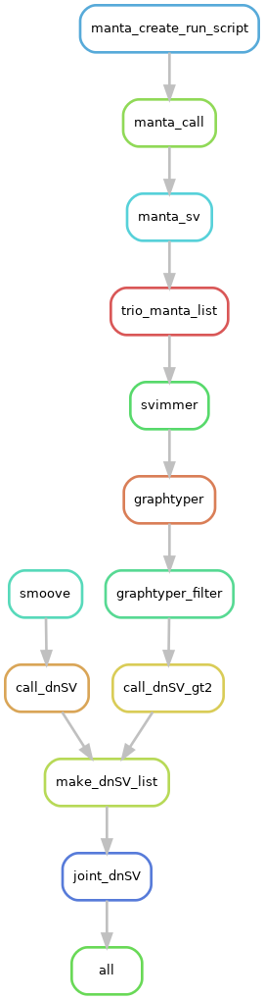

<!-- omit in toc -->
# Call de novo SV (dnSV)

---
- [Introcution](#introcution)
- [Dependencies](#dependencies)
  - [Install GraphTyper2 and svimmer](#install-graphtyper2-and-svimmer)
- [Get started](#get-started)
- [Notes](#notes)


---
## Introcution
We explored to call SVs using GraphTyper2 and smoove.

---
## Dependencies
### Install GraphTyper2 and svimmer
```bash
### Change folder to the TrioCompass working directory
cd /data/zhuw10/git/svimmer /data/DCEG_Trios/new_cgr_data/TriosCompass_v2/

git clone https://github.com/DecodeGenetics/svimmer.git

### Now svimmer is available as ./svimmer/svimmer

### Install GraphTyper binary under scripts/
wget https://github.com/DecodeGenetics/graphtyper/releases/download/v2.7.7/graphtyper -O scripts/graphtyper
chmod a+x scripts/graphtyper 
```
---
## Get started
This [sub-workflow](./Snakefile_dnSV) is follow-up processing of Snakefile_CGRv2, and it will be merged into the main workflow in the future.   



+ run the workflow
```bash
sbatch -J dnSV -t 200:00:00 --export=ALL --mem=12g -p norm  --wrap='./run_dnSV.sh '
```
---
## Notes
+ export REF_PATH and REF_CACHE in the wrapper script *run_dnSV.sh* as required by graphtyper
```bash
export REF_PATH=/data/DCEG_Trios/new_cgr_data/TriosCompass_v2/cache/%2s/%2s/%s:http://www.ebi.ac.uk/ena/cram/md5/%s
export REF_CACHE=/data/DCEG_Trios/new_cgr_data/TriosCompass_v2/cache/%2s/%2s/%s
```
+ Insertion is recognized as translocation (i.e., "BND") in [smoove/lumpy-sv](https://github.com/arq5x/lumpy-sv/issues/160).
+ Bam files (not cram fiels) are used by lumpy-sv.
+ Sample order in the ped file matters.  
  By default, we had built ped files in the order as: father, mother, and child. Therefore, the same order is kept in the jointly genotyped SV VCF file. Accordingly, we used this bcftools command to identify dnSV:
```bash
bcftools view -i 'GT[2]="het" && GT[1]="RR" && GT[0]="RR" ' -O v  {input} -o {output}
``` 